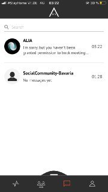
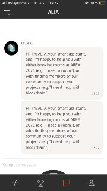

# ALIA
#### TABLE OF CONTENTS

* [WELCOME](#welcome)
* [ROOMBOKING](#roombooking)
* [BOOK A ROOM](#book-a-room)
* [MANAGE BOOKINGS](#manage-bookings)
* [FREQUENTLY ASKED QUESTIONS](#frequently-asked-questions)

## WELCOME  
Use your very own personal assistant to book meeting rooms at AREA 2071, or find needed expertise from across the ecosystem.

## ROOMBOKING  

ALIA is a smart assistant chatbot, where you can easily book a room for a specific time and a certain amount of people.

**Examples:** 
* "I want to book a room now"
* "I want to book a room for 2 hours" 
* "I want to book a room for 2 persons" 
* "I want to book Huddle"

## BOOK A ROOM  

<table>
  <thead>
  </thead>
  <tbody>
    <tr>
    <tr><td colspan="3"><b>Open the AREA 2071 Application on your smartphone.</b></td>      
    </tr>
    <tr>
      <td style="text-align: left">
<b></b>
Continue with FUTURE ID.</td>
      <td style="text-align: center"></td>
    </tr>
    <tr>
    <td style="text-align: left">
<b>Step 1:</b>
Click on the message icon, which you can find in the bottom bar.</td>
    <td style="text-align: center"></td>
    </tr>
    <tr>
    <td style="text-align: left">
<b>Step 2:</b>
Click on Alia</td>
    <td style="text-align: center"></td>
    </tr>
    <tr>
    <td style="text-align: left">
<b>Step 3:</b>
Now you can start to book a room by writing the Chatbot ALIA things like "Hi" and "I want to book a room now".</td>
    <td style="text-align: center"></td>
    </tr>
  </tbody>
</table>

## MANAGE BOOKINGS  

## FREQUENTLY ASKED QUESTIONS  
