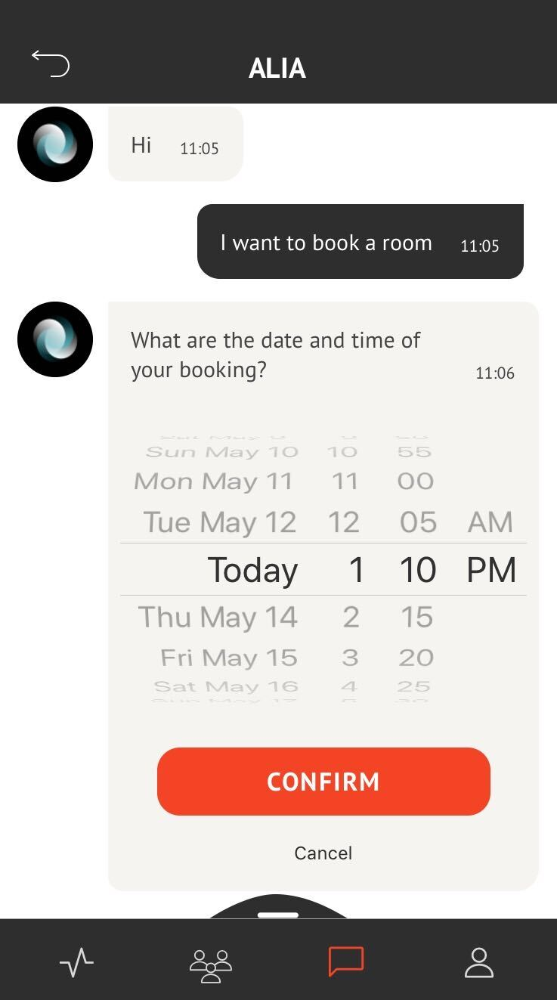
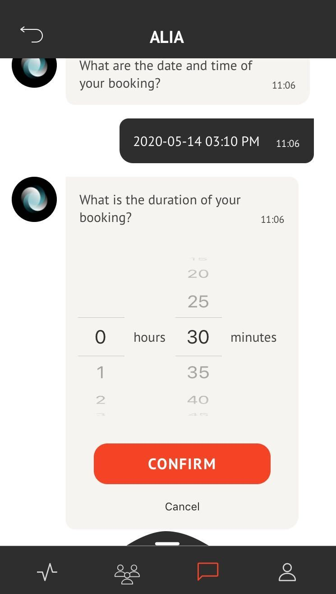
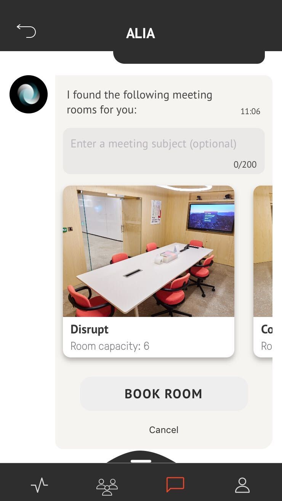
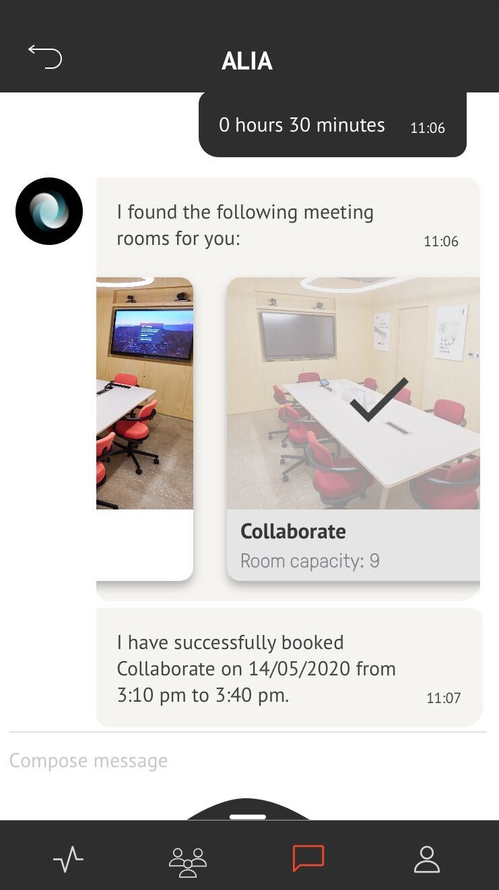

## BOOK A ROOM  

<table>
  <thead>
  </thead>
  <tbody>
    <tr>
    <tr><td colspan="3"><b>Open the AREA 2071 Application on your smartphone.</b></td>      
    </tr>
    <tr>
      <td style="text-align: left">
<b></b>
Continue with FUTURE ID.</td>
      <td style="text-align: center"></td>
    </tr>
    <tr>
    <td style="text-align: left">
<b>Step 1:</b>
Click on the message icon, which you can find in the bottom bar.</td>
    <td style="text-align: center"></td>
    </tr>
    <tr>
    <td style="text-align: left">
<b>Step 2:</b>
Click on Alia</td>
    <td style="text-align: center"></td>
    </tr>
    <tr>
    <td style="text-align: left">
<b>Step 3:</b>
Now you can start to book a room by writing to the Chatbot ALIA "I want to book a room". Afterwards select Date and Time of your room booking.</td>
    <td style="text-align: center"></td>
    </tr>
    <tr>
    <td style="text-align: left">
<b>Step 4:</b>
Select Duration of your room booking.</td>
    <td style="text-align: center"></td>
    </tr>
    <tr>
    <td style="text-align: left">
<b>Step 5:</b>
Select a room you want to book. Optional you can add a Meeting Subject.</td>
    <td style="text-align: center"></td>
    </tr>
    <tr>
    <td style="text-align: left">
<b>Step 5:</b>
Your room has successfully been booked..</td>
    <td style="text-align: center"></td>
    </tr>
  </tbody>
</table>
