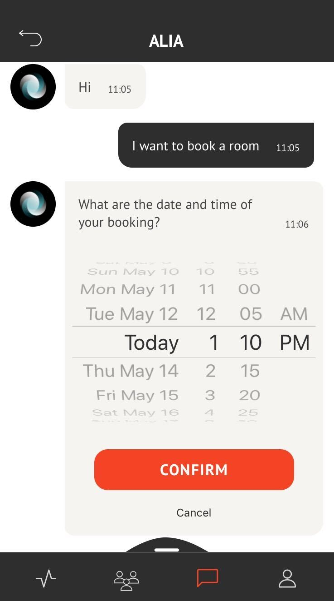
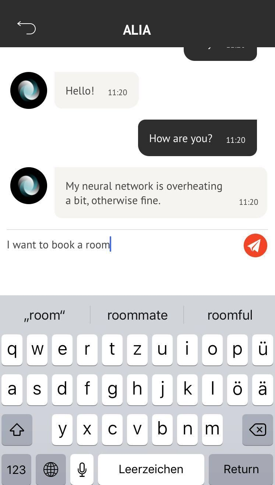

## CANCEL BOOKING PROCESS  

<table>
  <thead>
  </thead>
  <tbody>
    <tr>
    <tr><td colspan="3"><b>Open the AREA 2071 Application on your smartphone.</b></td>      
    </tr>
    <tr>
    <td style="text-align: left">
<b>Step 1:</b>
Click on the message icon, which you can find in the bottom bar.</td>
    <td style="text-align: center"></td>
    </tr>
    <tr>
    <td style="text-align: left">
<b>Step 2:</b>
Click on ALIA.</td>
    <td style="text-align: center"></td>
    </tr>
    <tr>
    <td style="text-align: left">
<b>Step 3:</b>
Now you can start to book a room by writing to the Chatbot ALIA "I want to book a room".</td>
    <td style="text-align: center"></td>
    </tr>
    <tr>
    <td style="text-align: left">
<b>Step 4:</b>
During the booking process you can simply click "Cancel" (below CONFIRM) to cancel your booking process.</td>
    <td style="text-align: center"></td>
    </tr>
    <tr>
    <tr><td colspan="3"><b>Your booking process has succesfully been cancelled..</b></td>      
    </tr>
  </tbody>
</table>
