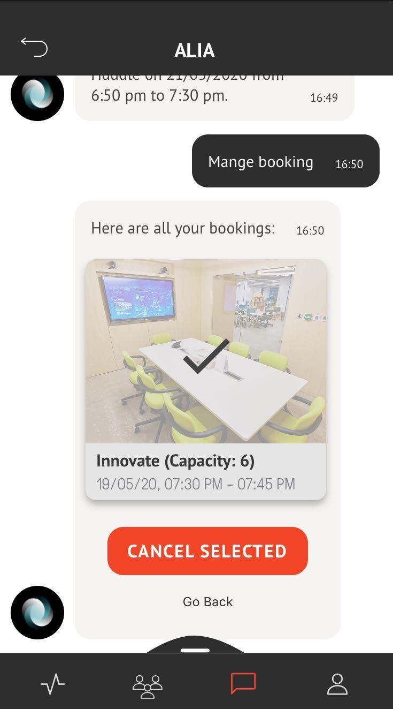

[GENERAL](/WIKI_README.md) > [ALIA](ALIA/README.md) > **[MANAGE BOOKINGS](ALIA/managebookings.md)**

## MANAGE BOOKINGS  

<table>
  <thead>
  </thead>
  <tbody>
    <tr>
    <tr><td colspan="3"><b>Open the AREA 2071 Application on your smartphone.</b></td>      
    </tr>
    <tr>
    <tr><td colspan="3"><b>Book a room.</b></td>      
    </tr>
    <tr>
    <td style="text-align: left">
<b>Step 1:</b>
With "Manage Bookings" you can see an overview of your booked rooms and choose which one you would like to cancel.</td>
    <td style="text-align: center"></td>
    </tr>
        <tr>
    <td style="text-align: left">
<b>Step 2:</b>
Confirm your cancelling by clicking "CANCEL SELECTED".</td>
    <td style="text-align: center"></td>
    </tr>
  </tbody>
</table>
