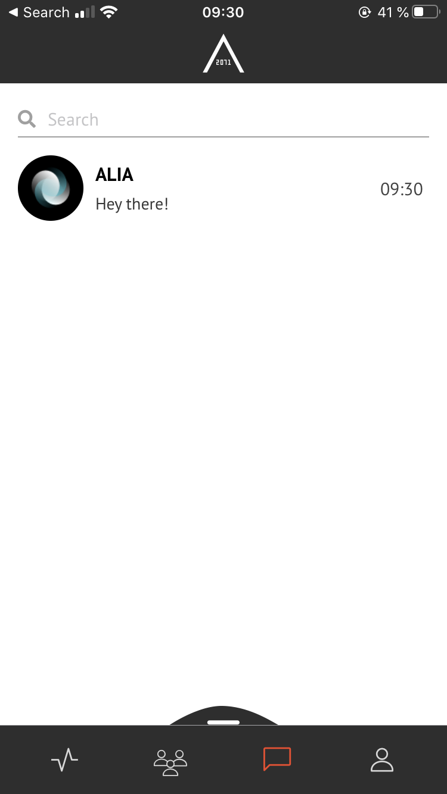
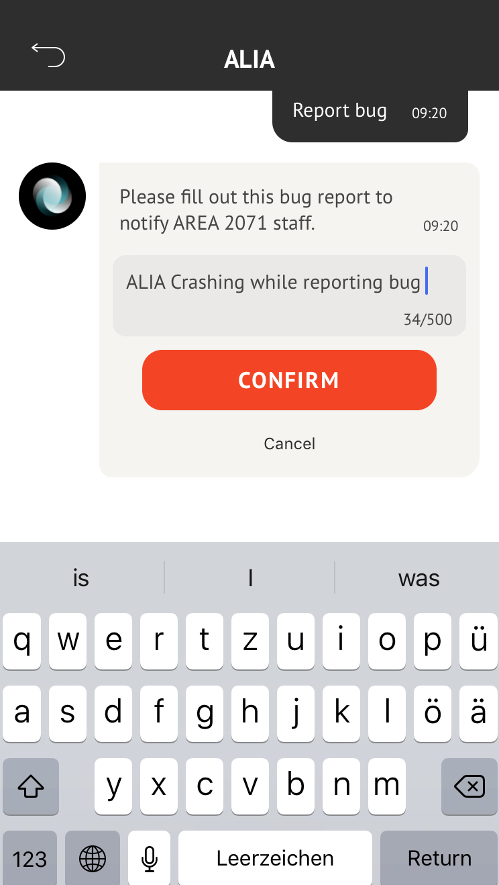

## REPORT BUG  

<table>
  <thead>
  </thead>
  <tbody>
    <tr>
      <tr><td colspan="3"><b>Open the AREA 2071 Application on your smartphone.</b></td>
    </tr>
    <tr>
    <td style="text-align: left">
<b>Step 1:</b>
Click on the Message icon, which you can find in the bottom bar.</td>
    <td style="text-align: center"></td>
    </tr>
    <tr>
    <td style="text-align: left">
<b>Step 2:</b>
Choose ALIA Chatbot below the search bar.</td>
    <td style="text-align: center"></td>
    </tr>
    <tr>
    <td style="text-align: left">
<b>Step 3:</b>
Write to ALIA "report bug" and add a Bug description and confirm your report by clicking "CONFIRM".</td>
    <td style="text-align: center"></td>
    </tr>
    <tr>
    <tr><td colspan="3"><b>Your error was reported.</b></td>
    </tr>
    </tbody>
</table>
