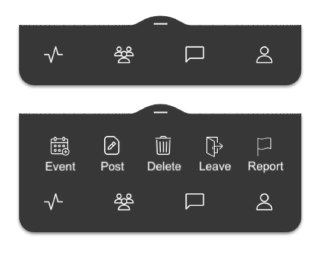
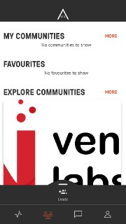
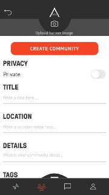
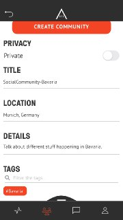
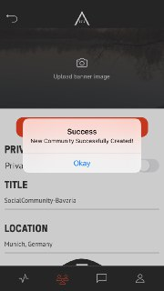
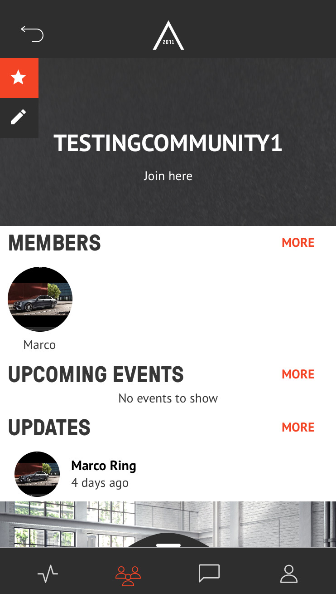
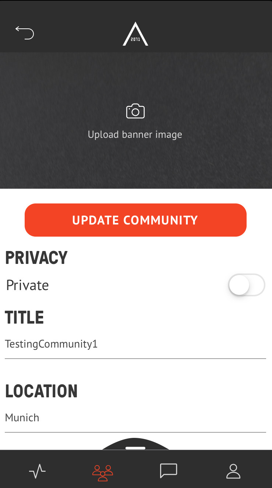

# AREA 2071
#### TABLE OF CONTENTS
* [WELCOME](#welcome)
* [COMMUNITIES](#communities)
* [CREATE COMMUNITIES](#create-communities)
* [FREQUENTLY ASKED QUESTIONS](#frequently-asked-questions)

## WELCOME

AREA 2071 is home to innovators, disruptors, and change makers. 
Join a global communityof the world's greatest minds and begin co-creating the future. Showcase your expertiseyour organisation, and the projects you're working on. 
Get access to mentorship, support, and a suite of benefits exclusive to the AREA 2071 community. 
AREA 2071 is a project managed by the Dubai Future Foundation in alignment with the vision of His Highness Sheikh Mohammed bin Rashid Al Maktoum, Vice President and Prime Minister of the UAE and Ruler of Dubai, and the UAE Centennial Plan.

## COMMUNITIES

Join a community or create your own, and begin co-creating with like-minded individuals from across our ecosystem.

## CREATE COMMUNITIES

<table>
  <thead>
  </thead>
  <tbody>
    <tr>
      <tr><td colspan="3"><b>Open the AREA 2071 Application on your smartphone.</b></td>      
    </tr>
    <tr>
      <td style="text-align: left">
<b>Step 1:</b>
Continue with FUTURE ID</td>
      <td style="text-align: center"></td>
    </tr>
    <tr>
    <td style="text-align: left">
<b>Step 2:</b>
If you can see this page page, you have successfully logged in.</td>
    <td style="text-align: center"></td>
    </tr>
    <tr>
    <td style="text-align: left">
<b>Smart Screen</b>
Swipe up on any screen to expose a menu of special options for the screen that you're on.</td>
    <td style="text-align: center"></td>
    </tr>
    <tr>
    <td style="text-align: left">
<b>Step 3:</b>
Click on the bottom bar on the community icon. Afterwards swipe up smart screen and click on "Create".</td>
    <td style="text-align: center"></td>
    </tr>
    <tr>
    <td style="text-align: left">
<b>Step 4:</b>
Fill out the required fields "Title", "Location", "Details" and "Tags" and decide if you want to make your new community either public or private. Afterwards upload an image as your Community banner.</td>
    <td style="text-align: center"></td>
    </tr>
    <tr>
    <td style="text-align: left">
<b></b>
Success. You created a new community!</td>
    <td style="text-align: center"></td>
    </tr>
    <tr>
    <td style="text-align: left">
<b></b>
You can find your new community under "MY COMMUNITIES"</td>
    <td style="text-align: center"></td>
    </tr>
    <tr>
      <tr><td colspan="3">Go to dashboard.</td>      
    </tr>
  </tbody>
</table>

## EDIT COMMUNITIES 

|||
| ------------- |:-------------:|  
| Open the AREA 2071 Application on your smartphone. Afterwards, click on the Community icon in the bottom bar.  | |
| Click on the edit button on the top left below the star. | |  
| Edit your Community. Afterwards click "UPDATE COMMUNITY".  | |  

## FREQUENTLY ASKED QUESTIONS
