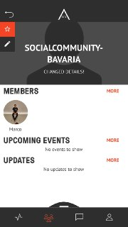
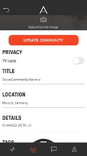
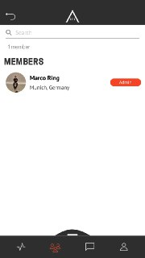
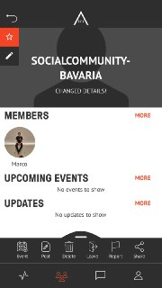
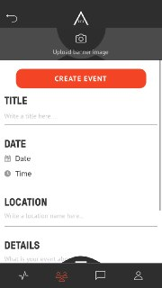
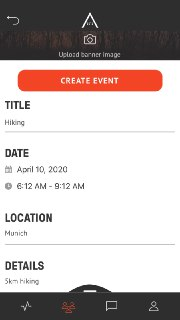
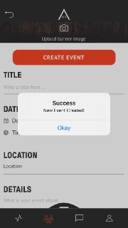
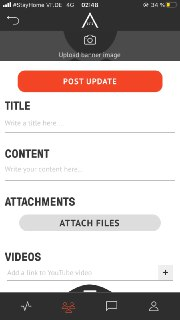
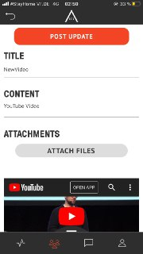
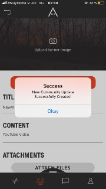

# AREA 2071
#### TABLE OF CONTENTS
* [WELCOME](#welcome)
* [COMMUNITIES](#communities)
* [CREATE COMMUNITIES](#create-communities)
* [EDIT COMMUNITIES](#edit-communities)
* [ADD MEMBERS TO A COMMUNITY](#add-members-to-a-community)
* [CREATE EVENTS](#create-events)
* [CREATE UPDATES](#create-updates)
* [FREQUENTLY ASKED QUESTIONS](#frequently-asked-questions)

## WELCOME  

AREA 2071 is home to innovators, disruptors, and change makers. 
Join a global communityof the world's greatest minds and begin co-creating the future. Showcase your expertiseyour organisation, and the projects you're working on. 
Get access to mentorship, support, and a suite of benefits exclusive to the AREA 2071 community. 
AREA 2071 is a project managed by the Dubai Future Foundation in alignment with the vision of His Highness Sheikh Mohammed bin Rashid Al Maktoum, Vice President and Prime Minister of the UAE and Ruler of Dubai, and the UAE Centennial Plan.

## COMMUNITIES  

Join a community or create your own, and begin co-creating with like-minded individuals from across our ecosystem.

## CREATE COMMUNITIES  

<table>
  <thead>
  </thead>
  <tbody>
    <tr>
      <tr><td colspan="3"><b>Open the AREA 2071 Application on your smartphone.</b></td>      
    </tr>
    <tr>
      <td style="text-align: left">
<b>Step 1:</b>
Continue with FUTURE ID.</td>
      <td style="text-align: center"></td>
    </tr>
    <tr>
    <td style="text-align: left">
<b>Step 2:</b>
If you can see this page page, you have successfully logged in.</td>
    <td style="text-align: center"></td>
    </tr>
    <tr>
    <td style="text-align: left">
<b>Smart Screen</b>
Swipe up on any screen to expose a menu of special options for the screen that you're on.</td>
    <td style="text-align: center"></td>
    </tr>
    <tr>
    <td style="text-align: left">
<b>Step 3:</b>
Click on the community icon, which you can find in the bottom bar. Afterwards swipe up smart screen and click on "Create".</td>
    <td style="text-align: center"></td>
    </tr>
    <tr>
    <td style="text-align: left">
<b>Step 3:</b>
Fill out the required fields "Title", "Location", "Details" and "Tags" and decide if you want to make your new community either public or private. Afterwards upload an image as your Community banner.</td>
    <td style="text-align: center"></td>
    </tr>
    <tr>
    <td style="text-align: left">
<b></b>
Success. You created a new community!</td>
    <td style="text-align: center"></td>
    </tr>
    <tr>
    <td style="text-align: left">
<b></b>
You can find your new community under "MY COMMUNITIES".</td>
    <td style="text-align: center"></td>
    </tr>
  </tbody>
</table>

## EDIT COMMUNITIES  

<table>
  <thead>
  </thead>
  <tbody>
    <tr>
    <tr><td colspan="3"><b>Open the AREA 2071 Application on your smartphone.</b></td>      
    </tr>
    <tr>
    <td style="text-align: left">
<b>Step 1:</b>
Click on the community icon, which you can find in the bottom bar and choose your community you want to edit.</td>
    <td style="text-align: center"></td>
    </tr>
    <tr>
    <td style="text-align: left">
<b>Step 2:</b>
Click on the edit button on the top left, below the star.</td>
    <td style="text-align: center"></td>
    </tr>
    <tr>
    <td style="text-align: left">
<b>Step 3:</b>
Edit your Community. Afterwards click "UPDATE COMMUNITY".</td>
    <td style="text-align: center"></td>
    </tr>
  </tbody>
</table>

## ADD MEMBERS TO A COMMUNITY  

<table>
  <thead>
  </thead>
  <tbody>
    <tr>
      <tr><td colspan="3"><b>Open the AREA 2071 Application on your smartphone.</b></td>      
    </tr>
    <tr>
    <td style="text-align: left">
<b>Step 1:</b>
Click on the Community icon, which you can find in the bottom bar.</td>
    <td style="text-align: center"></td>
    </tr>
    <tr>
    <td style="text-align: left">
<b>Step 2:</b>
Choose the Community you want to add members.</td>
    <td style="text-align: center"></td>
    </tr>
    <tr>
    <td style="text-align: left">
<b>Step 3:</b>
Choose the Community you want to add members.</td>
    <td style="text-align: center"></td>
    </tr>
    </tbody>
</table>

## CREATE EVENTS  

<table>
  <thead>
  </thead>
  <tbody>
    <tr>
    <tr><td colspan="3"><b>Open the AREA 2071 Application on your smartphone.</b></td>      
    </tr>
    <tr>
    <td style="text-align: left">
<b>Step 1:</b>
Click on the community icon, which you can find in the bottom bar.</td>
    <td style="text-align: center"></td>
    </tr>
    <tr>
    <td style="text-align: left">
<b>Smart Screen</b>
Swipe up on any screen to expose a menu of special options for the screen that you're on.</td>
    <td style="text-align: center"></td>
    </tr>
    <tr>
    <td style="text-align: left">
<b>Step 2:</b>
Swipe up Smart Screen and click on "Event".</td>
    <td style="text-align: center"></td>
    </tr>
    <tr>
    <td style="text-align: left">
<b>Step 3:</b>
Upload an image as your Event banner and fill out the required fields "Title", "Date", "Location", "Details" and "Tags".</td>
    <td style="text-align: center"></td>
    </tr>
    <tr>
    <td style="text-align: left">
<b>Step 4:</b>
Afterwards click on the button "CREATE EVENT".</td>
    <td style="text-align: center"></td>
    </tr>
    <tr>
    <td style="text-align: left">
<b></b>
Success. You have created a new Event!</td>
    <td style="text-align: center"></td>
    </tr>
  </tbody>
</table>

## CREATE UPDATES  

<table>
  <thead>
  </thead>
  <tbody>
    <tr>
      <tr><td colspan="3"><b>Open the AREA 2071 Application on your smartphone.</b></td>      
    </tr>
    <tr>
    <td style="text-align: left">
<b>Step 1:</b>
Click on the Community icon, which you can find in the bottom bar.</td>
    <td style="text-align: center"></td>
    </tr>
    <tr>
    <td style="text-align: left">
<b>Step 2:</b>
Choose the Community you want to edit.</td>
    <td style="text-align: center"></td>
    </tr>
    <tr>
    <td style="text-align: left">
<b>Smart Screen</b>
Swipe up on any screen to expose a menu of special options for the screen that you're on.</td>
    <td style="text-align: center"></td>
    </tr>
    <tr>
    <td style="text-align: left">
<b>Step 3:</b>
Swipe up Smart Screen and click on "Post".</td>
    <td style="text-align: center"></td>
    </tr>
    <tr>
    <td style="text-align: left">
<b>Step 4:</b>
Fill out the required fields "Title" and "Content" and upload an image as the banner of your update.</td>
    <td style="text-align: center"></td>
    </tr>
    <tr>
    <td style="text-align: left">
<b></b>
You can attach files or a YouTube URL as well. Afterwards click on "POST UPDATE"</td>
    <td style="text-align: center"></td>
    </tr>
    <tr>
    <td style="text-align: left">
<b></b>
Success. You have updated your Community!</td>
    <td style="text-align: center"></td>
    </tr>
  </tbody>
</table>

## FREQUENTLY ASKED QUESTIONS  
