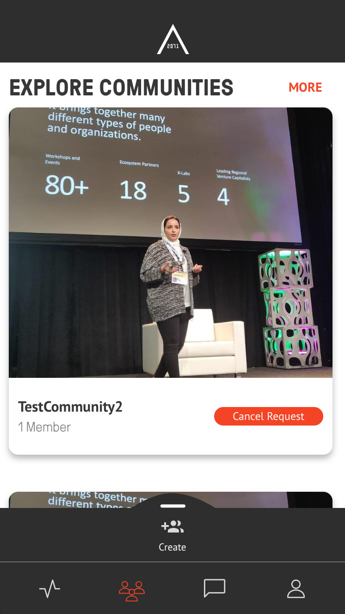
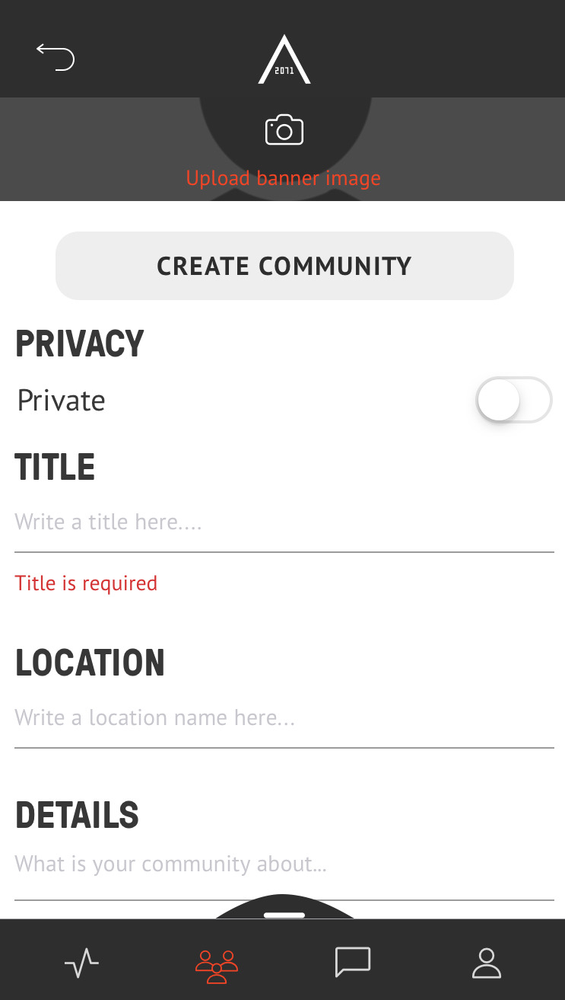

# AREA 2071
#### TABLE OF CONTENTS
* [WELCOME](#welcome)
* [COMMUNITIES](#communities)
* [CREATE COMMUNITIES](#create-communities)
* [FREQUENTLY ASKED QUESTIONS](#frequently-asked-questions)

## WELCOME

AREA 2071 is home to innovators, disruptors, and change makers. 
Join a global communityof the world's greatest minds and begin co-creating the future. Showcase your expertiseyour organisation, and the projects you're working on. 
Get access to mentorship, support, and a suite of benefits exclusive to the AREA 2071 community. 
AREA 2071 is a project managed by the Dubai Future Foundation in alignment with the vision of His Highness Sheikh Mohammed bin Rashid Al Maktoum, Vice President and Prime Minister of the UAE and Ruler of Dubai, and the UAE Centennial Plan.

## COMMUNITIES

Join a community or create your own, and begin co-creating with like-minded individuals from across our ecosystem.

## CREATE COMMUNITIES

|||
| ------------- |:-------------:|  
| Open the AREA 2071 Application on your smartphone. Afterwards, click on the Community icon in the bottom bar.  | |  
| Swipe up the "Create" a new Community bar above the bottom bar.  | |  
| Upload a banner image and make your new Community either Private or Public. Insert a title, location, details and tags.  | |

## EDIT COMMUNITIES 

|||
| ------------- |:-------------:|  
| Open the AREA 2071 Application on your smartphone. Afterwards, click on the Community icon in the bottom bar.  | |
| Click on the edit button on the top left below the star. | |  
| Edit your Community. Afterwards click "UPDATE COMMUNITY".  | |  

## FREQUENTLY ASKED QUESTIONS
