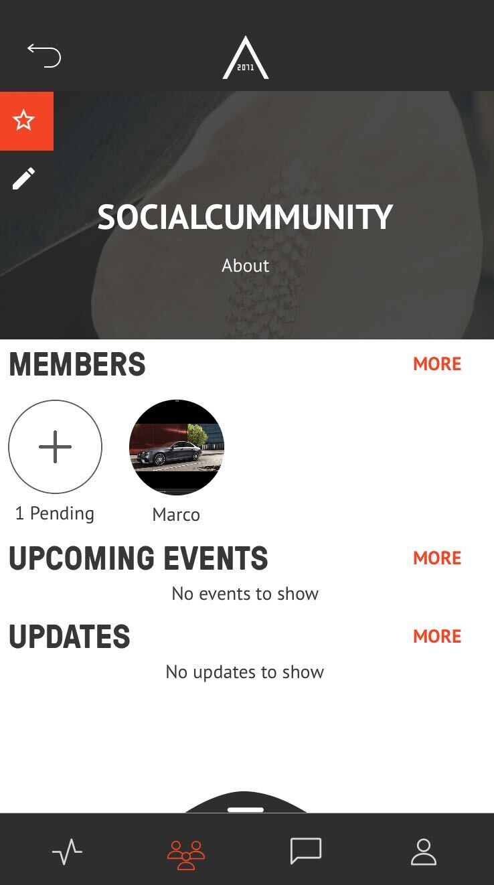
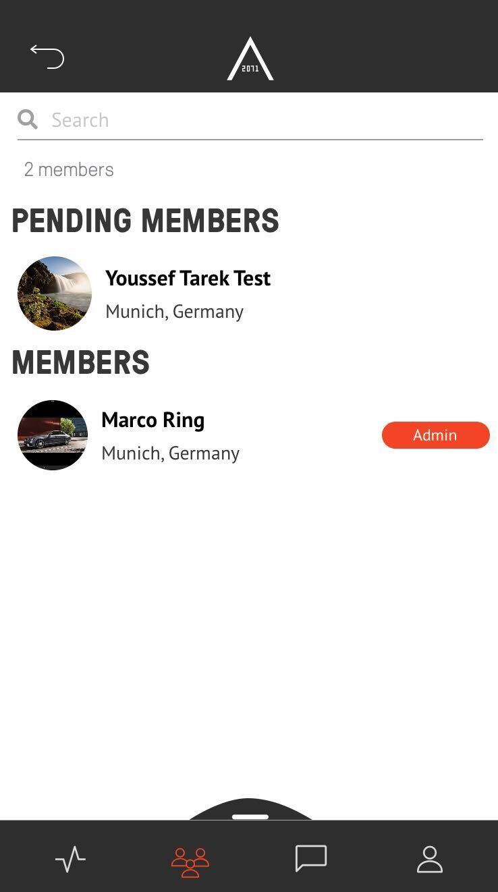
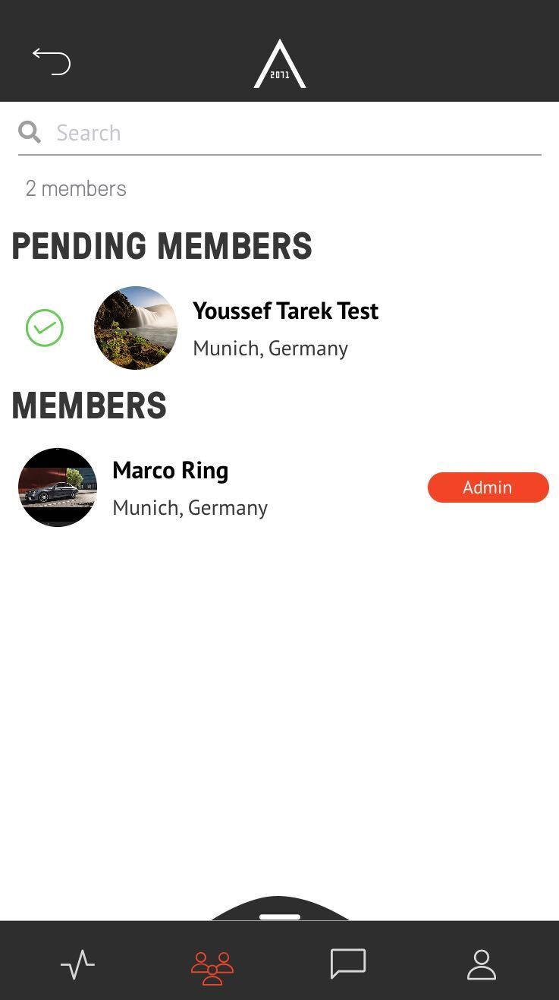

## ADD MEMBERS TO A COMMUNITY  

<table>
  <thead>
  </thead>
  <tbody>
    <tr>
      <tr><td colspan="3"><b>Open the AREA 2071 Application on your smartphone.</b></td>      
    </tr>
    <tr>
    <td style="text-align: left">
<b>Step 1:</b>
Click on the Community icon, which you can find in the bottom bar.</td>
    <td style="text-align: center"></td>
    </tr>
    <tr>
    <td style="text-align: left">
<b>Step 2:</b>
Choose the Community you want to add members and click on "MORE".</td>
    <td style="text-align: center"></td>
    </tr>
    <tr>
    <td style="text-align: left">
<b>Step 3:</b>
Search for members and add them to your Community.</td>
    <td style="text-align: center"></td>
    </tr>
    <td style="text-align: left">
<b>Pending Member  Step 1:</b>
If you want add "Pending Member" you have to click on the cross icon in your Community when it shows up.</td>
    <td style="text-align: center"></td>
    </tr>
    <tr>
    <td style="text-align: left">
<b>Pending Member  Step 2:</b>
Now you can accept a "Pending Member" to your Community by swiping his name to the right.</td>
    <td style="text-align: center"></td>
    </tr>
    <tr>
    <td style="text-align: left">
<b>Pending Member  Step 3:</b>
On the other hand you can declinde a "Pending Member" by swpiping his name to the left.</td>
    <td style="text-align: center"></td>
    </tr>
    </tbody>
</table>
