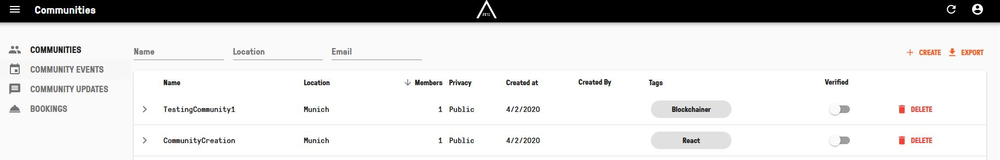
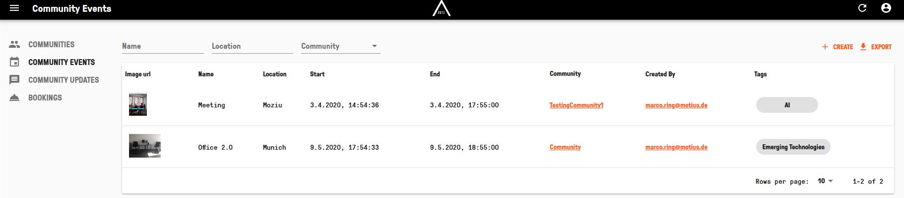
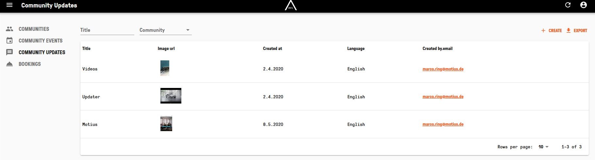
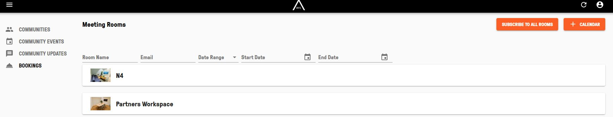

## ADMIN IN GENERAL  

Visit [https://admin.app.area2071.ae](https://admin.app.area2071.ae)

<table>
  <thead>
  </thead>
  <tbody>
    <tr>
    <td style="text-align: left">
<b>COMMUNITIES</b>
Here you can see Informations about each Community. Furthermore you can delete and verify each Community. You can also create and export Communites</td>
    <td style="text-align: center"></td>
    </tr>
    <tr>
    <td style="text-align: left">
<b>COMMUNITY EVENTS</b>
Here you can see Informations about each Community Event. Furthermore you can click on it and edit or delete Events. You can also create and export Events.</td>
    <td style="text-align: center"></td>
    </tr>
    <tr>
    <td style="text-align: left">
<b>COMMUNITY UPDATES</b>
Here you can see Informations about each Community News. Furthermore you can click on it and edit or delete News. You can also create and export News.</td>
    <td style="text-align: center"></td>
    </tr>
    <tr>
    <td style="text-align: left">
<b>BOOKINGS</b>
Here you cann see all Meeting Rooms. You can check Calendar and un-/subscribe to all rooms.</td>
    <td style="text-align: center"></td>
    </tr>
        <tr>
    <td style="text-align: left">
<b>LOGOUT</b>
If you want to logout of your account, click on the person icon on the very top right. Afterwards click on "LOGOUT".</td>
    <td style="text-align: center"></td>
    </tr>
    </tbody>
</table>
