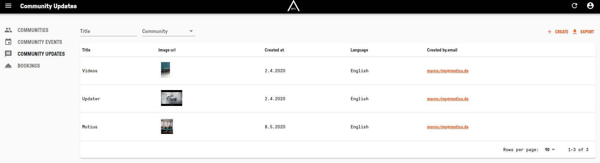
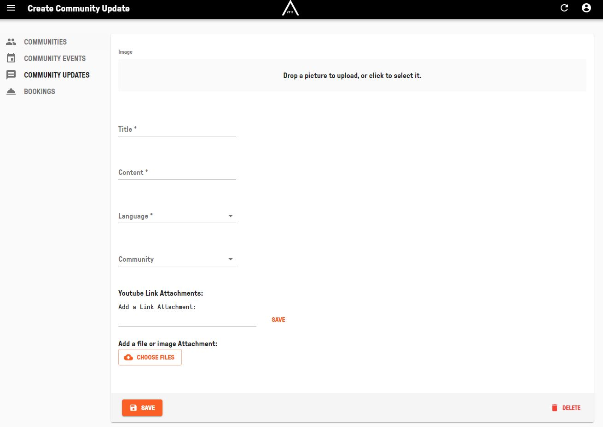
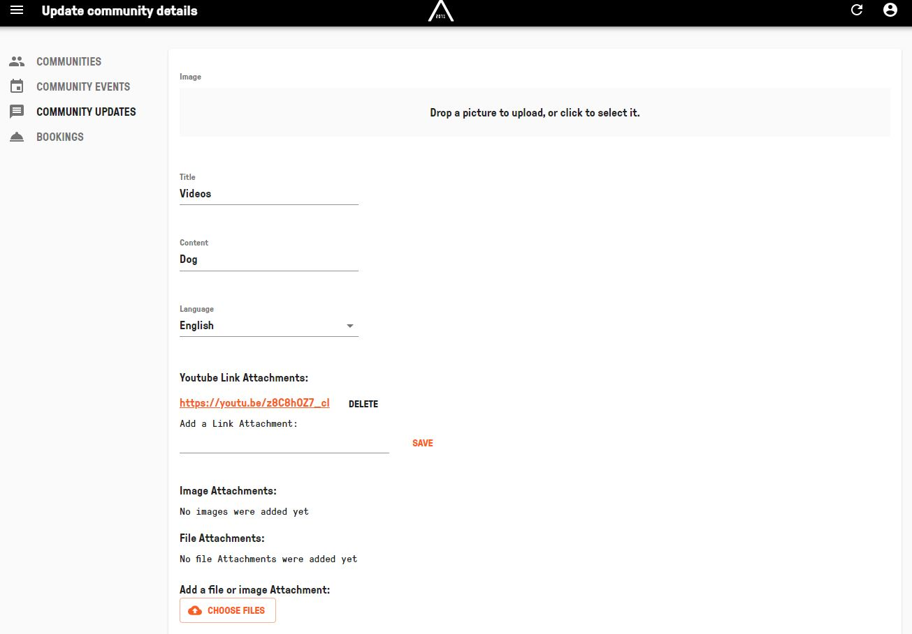

## CREATE AND EDIT NEWS  

Visit [https://admin.app.area2071.ae](https://admin.app.area2071.ae)

<table>
  <thead>
  </thead>
  <tbody>
    <tr>
      <tr><td colspan="3"><b>Login with FUTURE ID.</b></td>
    </tr>
    <tr>
    <td style="text-align: left">
<b>Create News Step 1:</b>
First click on the "COMMUNITY UPDATES" tab and afterwards on the "CREATE" button, which you can find on the top right.</td>
    <td style="text-align: center"></td>
    </tr>
    <tr>
    <td style="text-align: left">
<b>Create News Step 2:</b>
Now you can upload a picture to your news, add a "Title", "Content", "Language", "Community" as well as add a link or a file/image Attachment.</td>
    <td style="text-align: center"></td>
    </tr>
    <tr>
    <td style="text-align: left">
<b>Edit News Step 1:</b>
In the "COMMUNITY UPDATES" tab you can see all News you have already created inside communites. Here you can simply click on the News you want to edit.</td>
    <td style="text-align: center"></td>
    </tr>
    <tr>
    <td style="text-align: left">
<b>Edit News Step 2:</b>
Now you can upload a new picture to your news, edit "Title", "Content", "Language", "Community" as well as edit links or file/image Attachments.</td>
    <td style="text-align: center"></td>
    </tr>
    </tbody>
</table>
