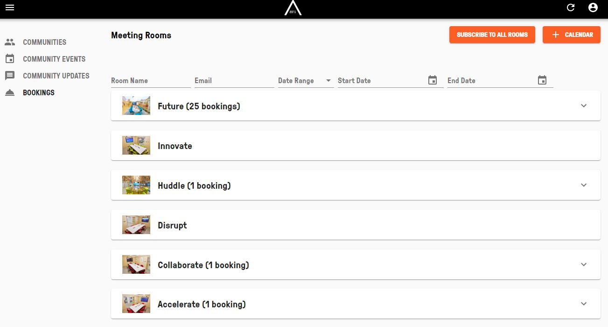
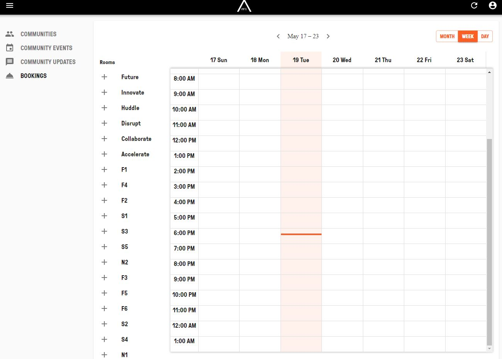
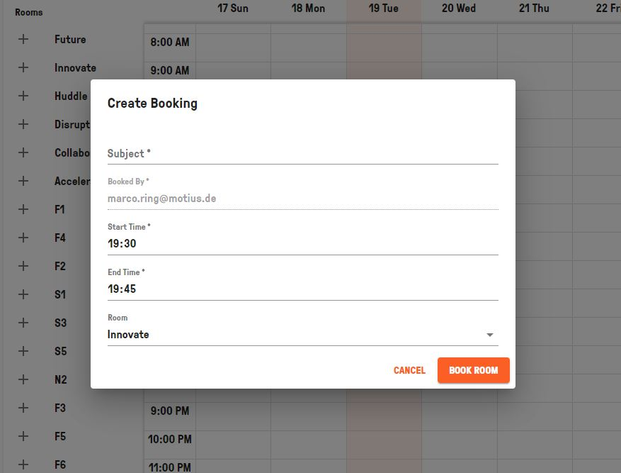

## CREATE AND EDIT ROOMS  

Visit [https://admin.app.area2071.ae](https://admin.app.area2071.ae)

<table>
  <thead>
  </thead>
  <tbody>
    <tr>
    <td style="text-align: left">
<b>Step 1:</b>
In the "BOOKINGS" tab you can see all the Meeting Rooms already booked. You can click on them and see which rooms where booked and cancel them.</td>
    <td style="text-align: center"></td>
    </tr>
    <tr>
    <td style="text-align: left">
<b>Step 2:</b>
You can click on "CALENDAR" to see all the bookings either of a month, a week or every single day.</td>
    <td style="text-align: center"></td>
    </tr>
    <tr>
    <td style="text-align: left">
<b>Step 3:</b>
Inside the calendar view you can click on specific time slots to book a room by inserting "Subject", "Booked By", "Start Time", "End Time" and "Room".  If you have already booked a room, you can click on the booked slot and edit your room booking in the calendar view as well.</td>
    <td style="text-align: center"></td>
    </tr>
    </tbody>
</table>
