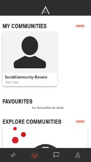

[GENERAL](/WIKI_README.md) > [AREA 2071](AREA/README.md) > **[CREATE COMMUNITIES](AREA/createcommunities.md)**

## CREATE COMMUNITIES  

<table>
  <thead>
  </thead>
  <tbody>
    <tr>
      <tr><td colspan="3"><b>Open the AREA 2071 Application on your smartphone.</b></td>      
    </tr>
    <tr>
      <td style="text-align: left">
<b>Step 1:</b>
Continue with FUTURE ID.</td>
      <td style="text-align: center"></td>
    </tr>
    <tr>
    <td style="text-align: left">
<b>Step 2:</b>
If you can see this page page, you have successfully logged in.</td>
    <td style="text-align: center"></td>
    </tr>
    <tr>
    <td style="text-align: left">
<b>Smart Screen</b>
Swipe up on any screen to expose a menu of special options for the screen that you're on.</td>
    <td style="text-align: center"></td>
    </tr>
    <tr>
    <td style="text-align: left">
<b>Step 3:</b>
Click on the community icon, which you can find in the bottom bar. Afterwards swipe up smart screen and click on "Create".</td>
    <td style="text-align: center"></td>
    </tr>
    <tr>
    <td style="text-align: left">
<b>Step 4:</b>
Upload an image as your Community banner, fill out the required fields "Title", "Location", "Details" and "Tags" and decide if you want to make your new community either public or private. Click "CREATE COMMUNITY" when you have added all the required information.</td>
    <td style="text-align: center"></td>
    </tr>
    <tr>
    <td style="text-align: left">
<b></b>
Success. You have created a new community!</td>
    <td style="text-align: center"></td>
    </tr>
    <tr>
    <td style="text-align: left">
<b></b>
You can find your new community under "MY COMMUNITIES" and if you want, you can mark them as your favourite one.</td>
    <td style="text-align: center"></td>
    </tr>
  </tbody>
</table>
