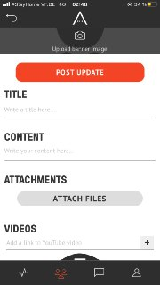
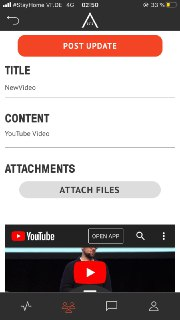

## CREATE UPDATES  

<table>
  <thead>
  </thead>
  <tbody>
    <tr>
      <tr><td colspan="3"><b>Open the AREA 2071 Application on your smartphone.</b></td>
    </tr>
    <tr>
    <td style="text-align: left">
<b>Step 1:</b>
Click on the Community icon, which you can find in the bottom bar.</td>
    <td style="text-align: center"></td>
    </tr>
    <tr>
    <td style="text-align: left">
<b>Step 2:</b>
Choose the Community you want to edit.</td>
    <td style="text-align: center"></td>
    </tr>
    <tr>
    <td style="text-align: left">
<b>Smart Screen</b>
Swipe up on any screen to expose a menu of special options for the screen that you're on.</td>
    <td style="text-align: center"></td>
    </tr>
    <tr>
    <td style="text-align: left">
<b>Step 3:</b>
Swipe up Smart Screen and click on "Post" to create an update.</td>
    <td style="text-align: center"></td>
    </tr>
    <tr>
    <td style="text-align: left">
<b>Step 4:</b>
Fill out the required fields "Title" and "Content" and upload an image as the banner of your update.</td>
    <td style="text-align: center"></td>
    </tr>
    <tr>
    <td style="text-align: left">
<b></b>
You can attach files or a YouTube URL as well. Afterwards click on "POST UPDATE"</td>
    <td style="text-align: center"></td>
    </tr>
    <tr>
    <td style="text-align: left">
<b></b>
Success. You have updated your Community!</td>
    <td style="text-align: center"></td>
    </tr>
  </tbody>
</table>
