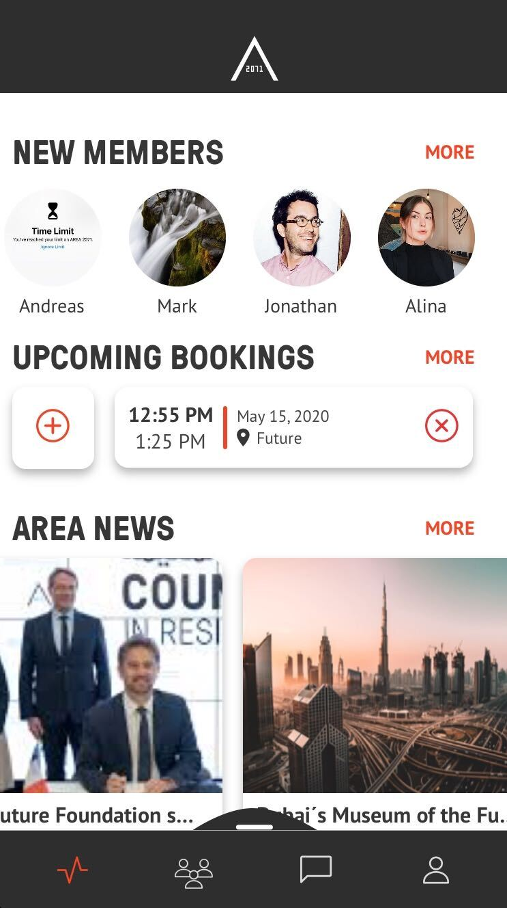
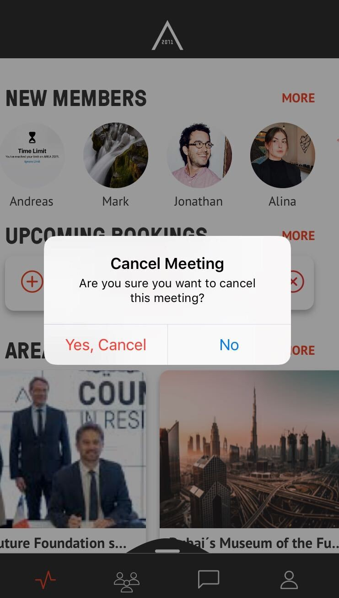

[GENERAL](GENERAL/README.md) > [AREA 2071](AREA/README.md) > **[DELETE BOOKING](AREA/deletebooking.md)**

## DELETE BOOKING  

<table>
  <thead>
  </thead>
  <tbody>
    <tr>
      <tr><td colspan="3"><b>Open the AREA 2071 Application on your smartphone.</b></td>
    </tr>
    <tr>
    <td style="text-align: left">
<b>Step 1:</b>
You can see your bookings on the landing page under "UPCOMING BOOKINGS". You can sipe to the left and see all your bookings. Delete a booking by clicking the orange cross on the right side.</td>
    <td style="text-align: center"></td>
    </tr>
    <tr>
    <td style="text-align: left">
<b>Step 1:</b>
Confirm your cancelation by clicking "Yes,Cancel".</td>
    <td style="text-align: center"></td>
    </tr>
    <tr>
       <tr><td colspan="3"><b>Member has successfully left your community.</b></td>
    </tr>
    </tbody>
</table>
