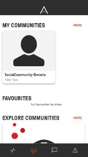

[GENERAL](/WIKI_README.md) > [AREA 2071](AREA/README.md) > **[EDIT COMMUNITIES](AREA/editcommunities.md)**

## EDIT COMMUNITIES  

<table>
  <thead>
  </thead>
  <tbody>
    <tr>
    <tr><td colspan="3"><b>Open the AREA 2071 Application on your smartphone.</b></td>      
    </tr>
    <tr>
    <td style="text-align: left">
<b>Step 1:</b>
Click on the community icon, which you can find in the bottom bar and choose your community you want to edit.</td>
    <td style="text-align: center"></td>
    </tr>
    <tr>
    <td style="text-align: left">
<b>Step 2:</b>
Click on the edit button on the top left, below the star.</td>
    <td style="text-align: center"></td>
    </tr>
    <tr>
    <td style="text-align: left">
<b>Step 3:</b>
Edit your Community. Afterwards click "UPDATE COMMUNITY" to save and publish your changes.</td>
    <td style="text-align: center"></td>
    </tr>
  </tbody>
</table>
