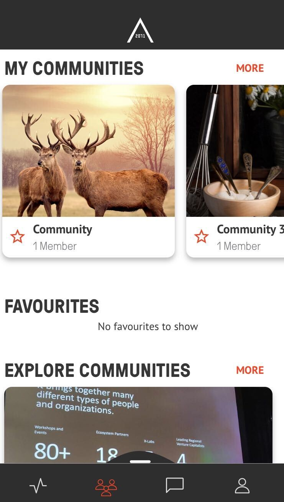

[GENERAL](/WIKI_README.md) > [AREA 2071](AREA/README.md) > **[FAVOURITE COMMUNITY](AREA/favouritecommunity.md)**

## FAVOURITE COMMUNITY  

<table>
  <thead>
  </thead>
  <tbody>
    <tr>
      <tr><td colspan="3"><b>Open the AREA 2071 Application on your smartphone.</b></td>      
    </tr>
    <tr>
      <tr><td colspan="3"><b>Create a Community.</b></td>      
    </tr>
    <tr>
    <td style="text-align: left">
<b>Step 1:</b>
You can mark a Community as your favourite Community either by clicking on the orange star under "MY COMMUNITIES".</td>
    <td style="text-align: center"></td>
    </tr>
    <tr>
    <td style="text-align: left">
<b>Step 2:</b>
Or you can mark a Community as your favourite Community by clicking the orange star inside the Community.</td>
    <td style="text-align: center"></td>
    </tr>
    <tr>
    <td style="text-align: left">
<b>Step 3:</b>
Success. Your Community has successfully marked as your favourite Community.</td>
    <td style="text-align: center"></td>
    </tr>
  </tbody>
</table>
