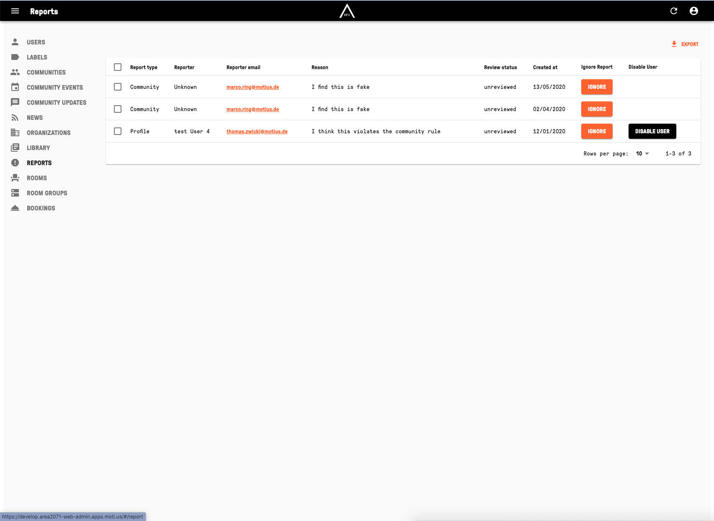

## HANDLE REPORTS  

Visit [https://admin.app.area2071.ae](https://admin.app.area2071.ae)

<table>
  <thead>
  </thead>
  <tbody>
    <tr>
    <td style="text-align: left">
<b>REPORTS</b>
In the "REPORTS" tab you can see all the reports reported from users including "Report type", "Reporter", "Reporter email", "Reason", "Review status" and "Created at". You can click on "IGNORE" to ignore specific reports and you can click on "DISABLE USER" to disable them. On the top right is an "EXPORT" button to export reports.</td>
    <td style="text-align: center"></td>
    </tr>
    </tbody>
</table>
