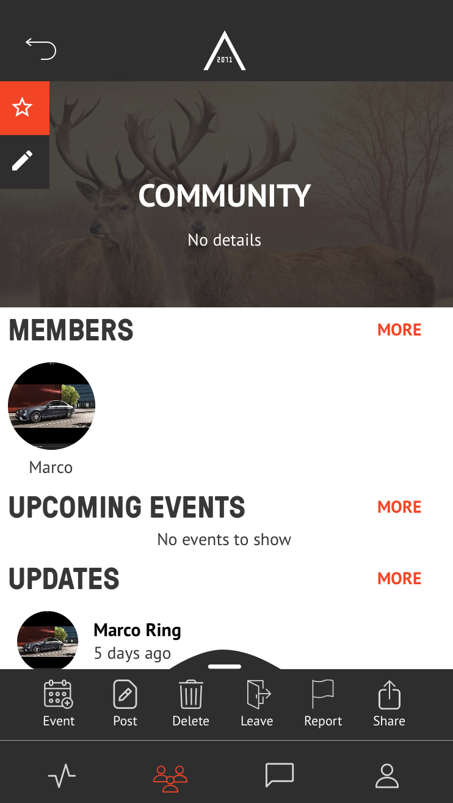
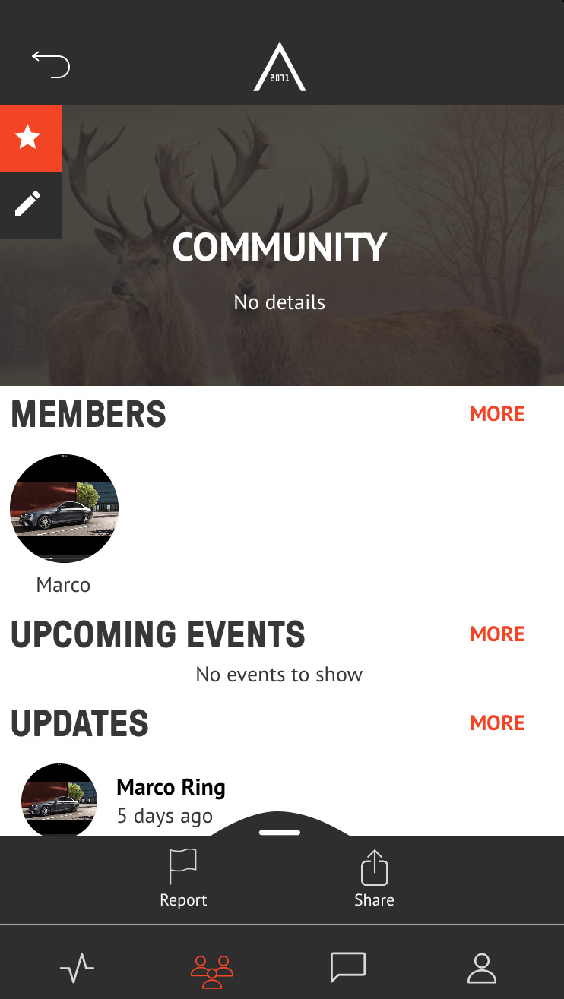
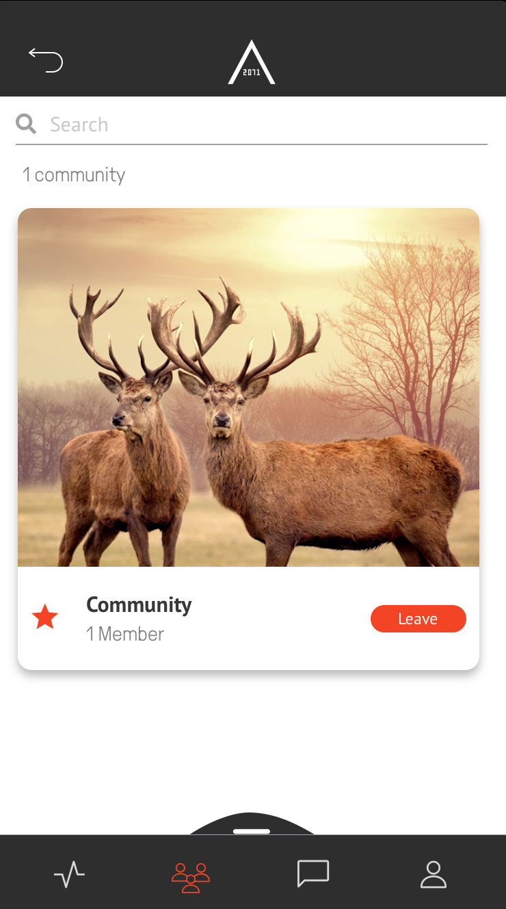

## LEAVE COMMUNITY  

<table>
  <thead>
  </thead>
  <tbody>
    <tr>
      <tr><td colspan="3"><b>Open the AREA 2071 Application on your smartphone.</b></td>
    </tr>
    <tr>
    <td style="text-align: left">
<b>Step 1:</b>
Click on the Community icon, which you can find in the bottom bar.</td>
    <td style="text-align: center"></td>
    </tr>
    <tr>
    <td style="text-align: left">
<b>Step 2:</b>
Cllick on the Community you want to leave.</td>
    <td style="text-align: center"></td>
    </tr>
    <tr>
    <td style="text-align: left">
<b>Step 3:</b>
Swipe up the Smart Menu and click "Leave" to leave your community.</td>
    <td style="text-align: center"></td>
    </tr>
    <tr>
    <td style="text-align: left">
<b>Step 4:</b>
If your Smart Menu hasn't looked like the Smart Menu on the image from Step 3, you first have to make sure you haven't marked the Community as your favourite. Click on the orange star on the top left to unmark it, if it was the case.</td>
    <td style="text-align: center"></td>
    </tr>
    <tr>
    <td style="text-align: left">
<b></b>
Member has successfully left your community.</td>
    </tr>
    </tbody>
</table>
