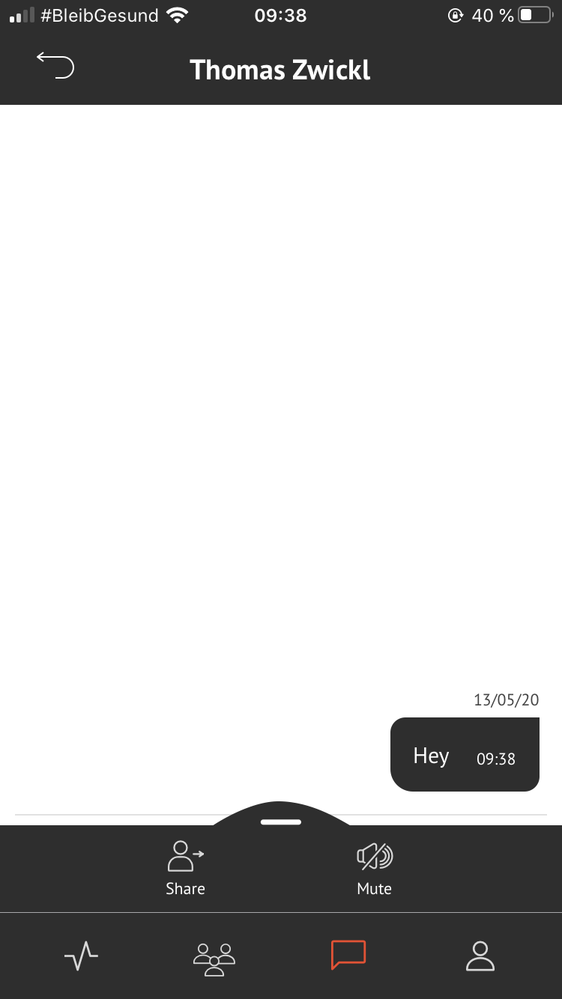
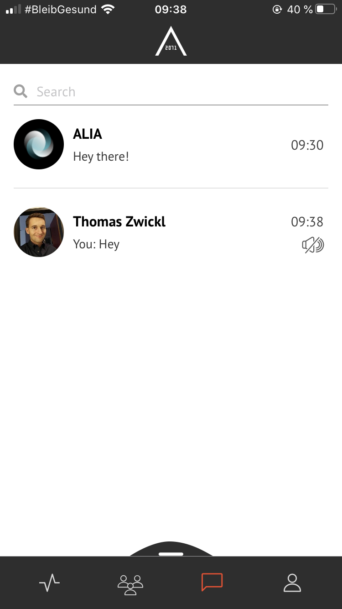

## MUTE CHAT  

<table>
  <thead>
  </thead>
  <tbody>
    <tr>
      <tr><td colspan="3"><b>Open the AREA 2071 Application on your smartphone.</b></td>
    </tr>
    <tr>
    <td style="text-align: left">
<b>Step 1:</b>
Click on the Message icon, which you can find in the bottom bar.</td>
    <td style="text-align: center"></td>
    </tr>
    <tr>
    <td style="text-align: left">
<b>Step 2:</b>
Choose the chat you want to mute.</td>
    <td style="text-align: center"></td>
    </tr>
    <tr>
    <td style="text-align: left">
<b>Step 3:</b>
Swipe up Smart Menu and click on "mute".</td>
    <td style="text-align: center"></td>
    </tr>
    <tr>
    <td style="text-align: left">
<b>Step 4:</b>
You can check if your chat has successfully been muted if you can see the mute icon in the messages window.</td>
    <td style="text-align: center"></td>
    </tr>
    <tr>
    <td style="text-align: left">
<b></b>
Your chat has successfully been muted.</td>
    </tr>
    </tbody>
</table>
