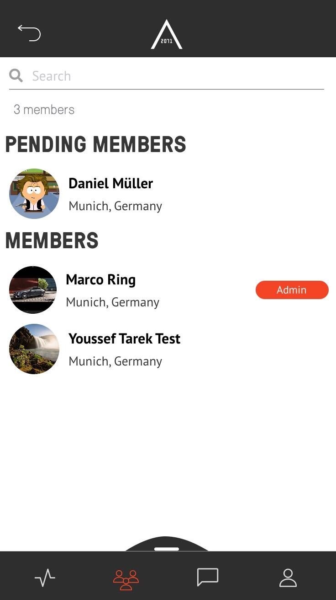

## SHARE ADMIN RIGHTS  

Visit [https://admin.app.area2071.ae](https://admin.app.area2071.ae)

<table>
  <thead>
  </thead>
  <tbody>
    <tr>
    <tr><td colspan="3"><b>Open the AREA 2071 Application on your smartphone.</b></td>      
    </tr>
    <tr>
    <td style="text-align: left">
<b>Step 1:</b>
Click on the community icon, which you can find in the bottom bar and choose your community you want to share admin rights.</td>
    <td style="text-align: center"></td>
    </tr>
    <tr>
    <td style="text-align: left">
<b>Step 2:</b>
Click on "MORE" besides Members to choose someone you want to give admin rights.</td>
    <td style="text-align: center"></td>
    </tr>
    <tr>
    <td style="text-align: left">
<b>Step 3:</b>
Swipe to the lift.</td>
    <td style="text-align: center"></td>
    </tr>
    <tr>
    <td style="text-align: left">
<b>Step 4:</b>
Now you can see three green arrows. Click on them to make the member an Admin.</td>
    <td style="text-align: center"></td>
    </tr>
    <tr>
    <td style="text-align: left">
<b>Step 4:</b>
Now you can see the Member marked as "Admin".</td>
    <td style="text-align: center"></td>
    </tr>
  </tbody>
</table>
