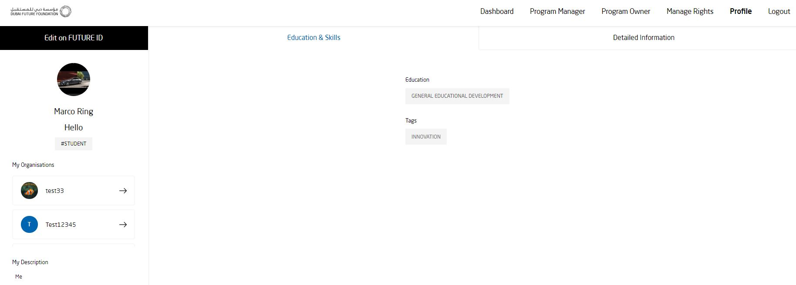
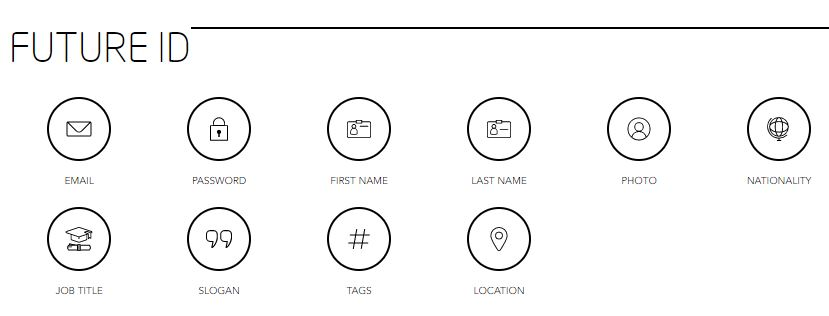
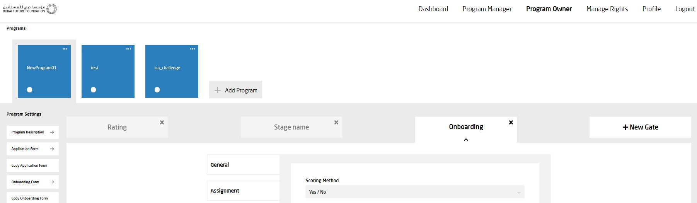
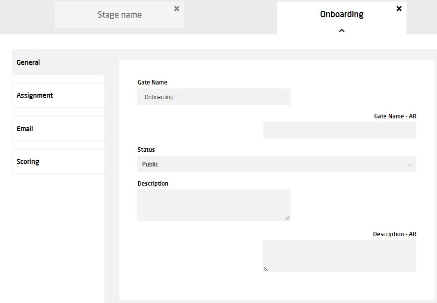
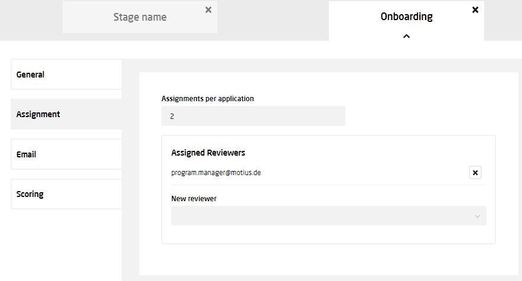
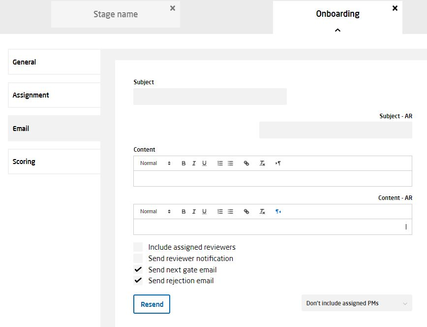
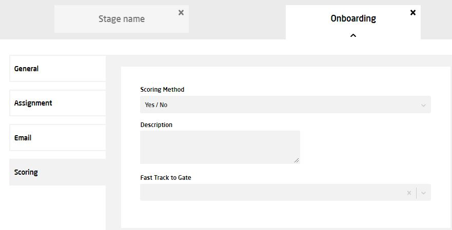

# DUBAI FUTURE PROGRAMS
#### TABLE OF CONTENTS

* [WELCOME](#welcome)
* [PROGRAMS](#programs)
* [APPLICATION TO A PROGRAM](#application-to-a-program)
* [EEDIT PROFILE](#edit-profile)
* [PROGRAM OWNER](#program-owner)
* [CREATE PROGRAM](#create-a-program)
* [ONBOARDING STAGE](#onboarding-stage)
* [REVIEW APPLICATION](#review-applications)
* [FREQUENTLY ASKED QUESTIONS](#frequently-asked-questions)

## WELCOME  

Dubai Future Programs is an open platform for innovation. It stands to its name as it helps both corporate and public sectors get access and connect with creative entrepreneurs and unique startups to co-create the future.

Working closely with technology leaders in the region and internationally, allows us the opportunity to connect government partners, startups and industry leaders in a unique tech ecosystem to maximize, accelerate and boost the impact of innovation. Dubai Future Programs opens an abundance of opportunities for startups to partner with government entities and industry leaders through its programs to solve problems.

Helping governments, and industry leaders navigate and address complex technology challenges through a number of programs that connect startups to develop solutions to real challenges. Startups work with government and industry partners to understand identified problems. Through a streamlined process, startups develop solutions with an expedited pathway to implementation.

### PROGRAMS  

**Use Cases**

Learn firsthand the application of cutting-edge technologies like artificial intelligence and robotics, 3D printing, and new business models and best practices

**Access to Startups**

Get unique access to startups that are changing the landscape of technology.

**Build Relationships**

Engage with public sector leaders and civic entrepreneurs bringing new, innovative technologies to the public sector to drive impact in government.

## APPLICATION TO A PROGRAM  

Visit [Dubai Future Programs](https://programs.dubaifuture.gov.ae)

* Click on "Login/Register":
  * If you're already signed in with FUTURE ID, you'll automatically be logged in.
  * If you're not signed in with FUTURE ID, you'll be redirected to FUTURE ID to sign in.

 

*  Create your future match:
    * Drag & Drop an Organisation with which you want to apply for a Program into the left rectangle with a cross in the middle.
    * Drag & Drop a Program for which you want to apply with your Organisation into the right rectangle with a cross in the middle.

 

**EXAMPLE:** Retina Images VR

*  Apply now:
    * Select your organisation.
    * Select participants.
      * If you have a golden ticket, please provide it into the field below "Golden ticket"
    * Click on the button "Next Step"

 

*  Next Step:
    * Choose your country.
    * Select Points you achieved on a scale from 1 to 7.
    * Select Rounds you made on a scale from 1 to 4.
      * Select yes, if you won the FINALE.
      * Select no, if you didn't win the FINALE.
    * Click on "Submit".

 

 

## EDIT PROFILE  

Visit [Dubai Future Programs](https://programs.dubaifuture.gov.ae)

<table>
  <thead>
  </thead>
  <tbody>
    <tr>
      <tr><td colspan="3"><b>Register/Login</b></td>      
    </tr>
    <tr>
      <td style="text-align: left">
<b>Step 1:</b>
Click the "Profile" tab on the top right. Afterwards click on "Edit on FUTURE ID", above your profile picture.</td>
      <td style="text-align: center"></td>
    </tr>
    <tr>
      <td style="text-align: left">
<b>Step 2:</b>
You will get redirected to FUTURE ID, where you can edit your profile.</td>
      <td style="text-align: center"></td>
    </tr>
  </tbody>
</table>

## PROGRAM OWNER  

A Program Owner owns a Program on DUBAI FUTURE PROGRAMS. A Program Owner can change program settings, manage rights and add new gates.

## CREATE A PROGRAM  

Visit [Dubai Future Programs](https://programs.dubaifuture.gov.ae)

<table>
  <thead>
  </thead>
  <tbody>
    <tr>
      <tr><td colspan="3"><b>Register/Login</b></td>      
    </tr>
    <tr>
      <td style="text-align: left">
<b>Step 1:</b>
Click the "Program Owner" tab on the top right. Afterwards click on "Add Program".</td>
      <td style="text-align: center"></td>
    </tr>
    <tr>
      <td style="text-align: left">
<b>Step 2:</b>
Fill out all the required fields and click on "Create" to create a new program.</td>
      <td style="text-align: center"></td>
    </tr>
    <tr>
      <td style="text-align: left">
<b>Step 3:</b>
You have successfully created a new program.</td>
      <td style="text-align: center"></td>
    </tr>
  </tbody>
</table>

## ONBOARDING STAGE  

<table>
  <thead>
  </thead>
  <tbody>
   <tr>
      <tr><td colspan="3"><b>Register/Login</b></td>      
    </tr>
    <tr>
      <td style="text-align: left">
<b></b>
Click on the "Program Owner" tab on the top right.</td>
      <td style="text-align: center"></td>
    </tr>
    <tr>
      <td style="text-align: left">
<b>General:</b>
Here you can edit general information like Gate Name, Status and Description.</td>
      <td style="text-align: center"></td>
    </tr>
        <tr>
      <td style="text-align: left">
<b>Assignment:</b>
Here you can choose how many assignments you want per application, as well as edit assigned reviewers and add new reviewr.</td>
      <td style="text-align: center"></td>
    </tr>
        <tr>
      <td style="text-align: left">
<b>Email:</b>
Here you can resend template Emails.</td>
      <td style="text-align: center"></td>
    </tr>
        <tr>
      <td style="text-align: left">
<b>Scoring:</b>
Here you can add Scoring Method, Description and Fast Track to Gate.</td>
      <td style="text-align: center"></td>
    </tr>
  </tbody>
</table>

## REVIEW APPLICATIONS  

<table>
  <thead>
  </thead>
  <tbody>
   <tr>
      <tr><td colspan="3"><b>Register/Login</b></td>      
    </tr>
    <tr>
      <td style="text-align: left">
<b></b>
Kanban style review page, where we see all application (or only assigned for reviewers) on each gate.</td>
      <td style="text-align: center"></td>
    </tr>
    <tr>
      <td style="text-align: left">
<b>Step 1:</b>
Click on the "Review" tab on the top right. </td>
      <td style="text-align: center"></td>
    </tr>
        <tr>
      <td style="text-align: left">
<b>Step 2:</b>
Now you can see different applications on different stages. You can either "Approve" or "Reject" an application by clicking on of those buttons on the bottom right.</td>
      <td style="text-align: center"></td>
    </tr>
        <tr>
      <td style="text-align: left">
<b>Step 3:</b>
If you decide to reject an application, you have to approve your rejection twice. </td>
      <td style="text-align: center"></td>
    </tr>
        <tr>
      <td style="text-align: left">
<b>Step 4:</b>
On the bottom left you can move applications between different gates. </td>
      <td style="text-align: center"></td>
    </tr>
  </tbody>
</table>

## USER MANUAL  

#### TODO

* [TODO](link.md)

## FREQUENTLY ASKED QUESTIONS  
