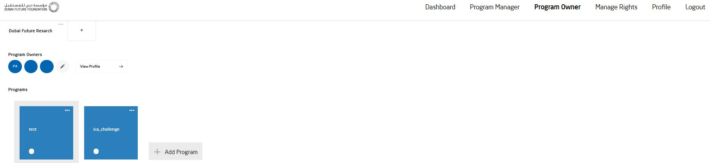
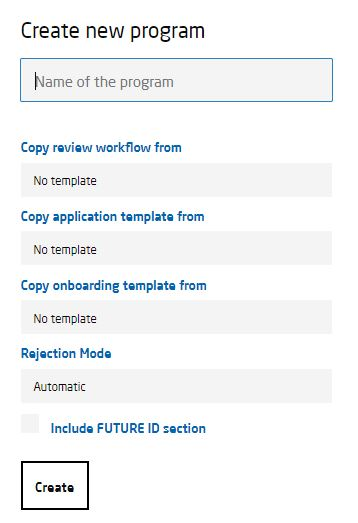
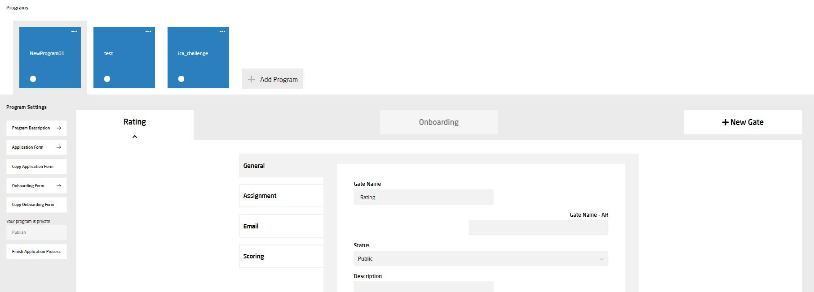

## CREATE PROGRAM  

Visit [Dubai Future Programs](https://programs.dubaifuture.gov.ae)

<table>
  <thead>
  </thead>
  <tbody>
    <tr>
      <tr><td colspan="3"><b>Register/Login</b></td>      
    </tr>
    <tr>
      <td style="text-align: left">
<b>Step 1:</b>
Click the "Program Owner" tab on the top right. Afterwards click on "Add Program".</td>
      <td style="text-align: center"></td>
    </tr>
    <tr>
      <td style="text-align: left">
<b>Step 2:</b>
Fill out all the required fields, mark "include FUTURE ID section" with a cross and click on "Create" to create a new program.  (FUTURE ID section means that you are willing to allow transfering data between DF-PROGRAMS and FUTURE ID)</td>
      <td style="text-align: center"></td>
    </tr>
    <tr>
      <td style="text-align: left">
<b>Step 3:</b>
You have successfully created a new program.</td>
      <td style="text-align: center"></td>
    </tr>
  </tbody>
</table>
