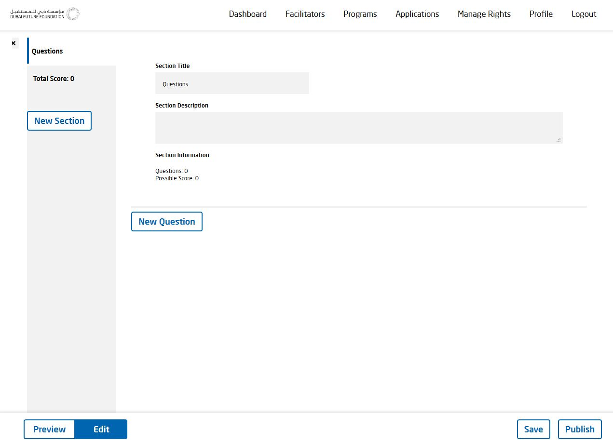

[GENERAL](GENERAL/README.md) > [DF-PROGRAMS](DF-Programs/README.md) > **[ONBOARDING STAGE](DF-Programs/createaprogram.md)**

## CREATE PROGRAM  

Visit [Dubai Future Programs](https://programs.dubaifuture.gov.ae)

<table>
  <thead>
  </thead>
  <tbody>
    <tr>
      <tr><td colspan="3"><b>Register/Login</b></td>      
    </tr>
    <tr>
      <td style="text-align: left">
<b>Step 1:</b>
Click the "Programs" tab on the top right. Afterwards click on "Add Program".</td>
      <td style="text-align: center"></td>
    </tr>
    <tr>
      <td style="text-align: left">
<b>Step 2:</b>
Fill out all the required fields, mark "include FUTURE ID section" with a cross and click on "Create" to create a new program.  (FUTURE ID section means that you are willing to allow transfering data between DF-PROGRAMS and FUTURE ID so that the user can prefill his application data with his FUTURE ID profile)</td>
      <td style="text-align: center"></td>
    </tr>
    <tr>
      <td style="text-align: left">
<b>Step 3:</b>
Here you will get an overview about current Gates. You can add a new gate by clicking on "Add Gate". Furthermore you can edit your "Program Description" and your "Application Form" by clicking on the buttons on the top left.</td>
      <td style="text-align: center"></td>
    </tr>
    <tr>
      <td style="text-align: left">
<b>Step 4:</b>
[Program Description] After clicking on "Program Description" you can edit your description, change it between "Private" and "Public, share it on Social Media and change your Application Mode. When you have finished the editing process you can conclude by clicking on "Finish application process".</td>
      <td style="text-align: center"></td>
    </tr>
    <tr>
      <td style="text-align: left">
<b>Step 5:</b>
[Application Form] After clicking on "Application Form" you can add new Sections and new Questions to your Application Form. If you want you can preview it by clicking on "Preview" on the bottom left of your screen. In the end click on "Save" and "Publish" on the bottom right of your screen.</td>
      <td style="text-align: center"></td>
    </tr>
    <tr>
  <td style="text-align: left">
<b>Application Form / New Question</b>
Fill out the required fields "Title", "Type", "FUTURE ID key", "Question Description" and "Max. Character length" of your new question.</td>
      <td style="text-align: center"></td>
    </tr>
  </tbody>
</table>
