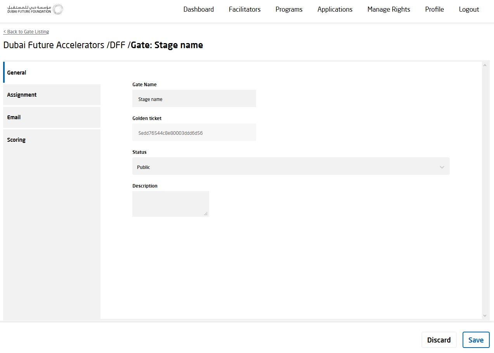
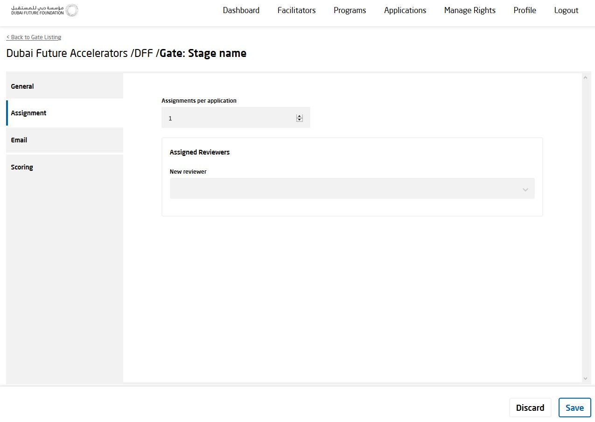
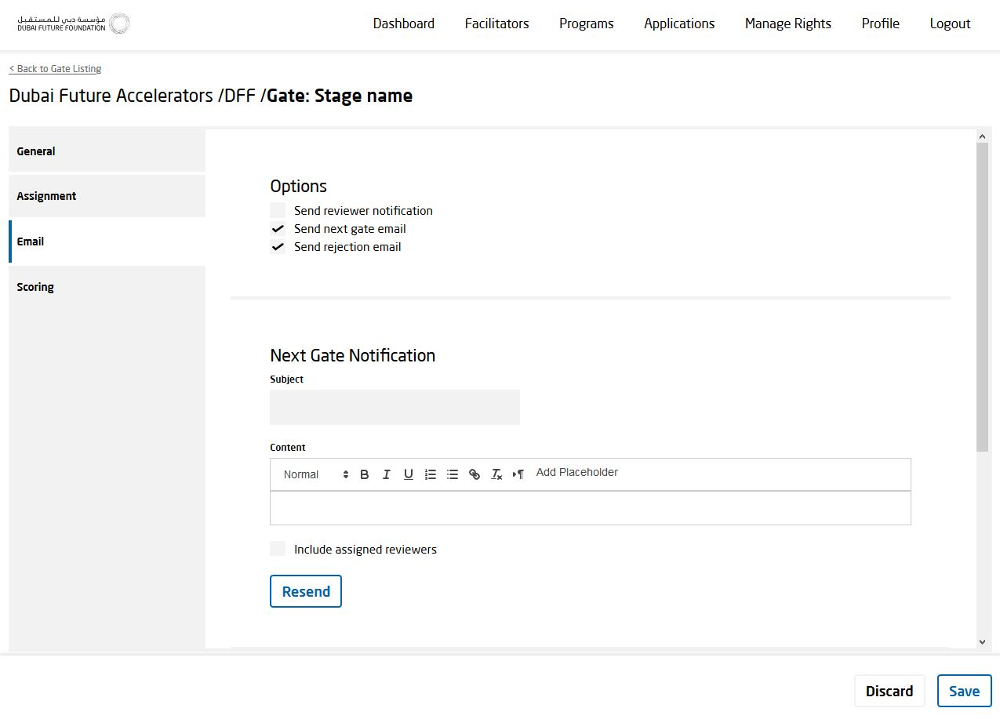
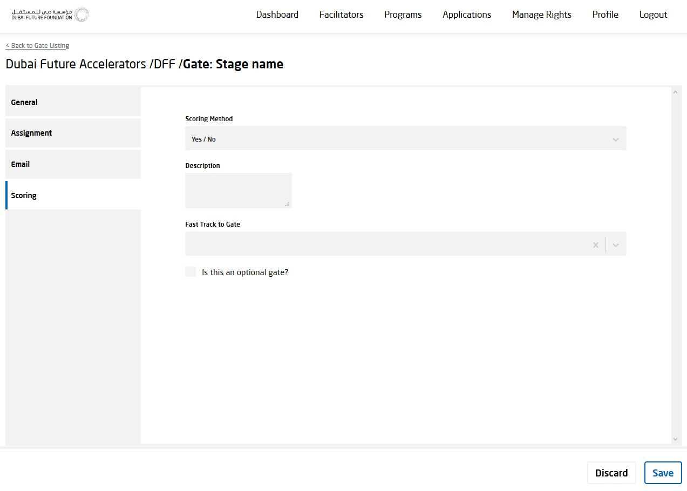

[GENERAL](GENERAL/README.md) > [DF-PROGRAMS](DF-Programs/README.md) > **[ONBOARDING STAGE](DF-Programs/onboardingstage.md)**

## ONBOARDING STAGE  

<table>
  <thead>
  </thead>
  <tbody>
   <tr>
      <tr><td colspan="3"><b>Register/Login</b></td>      
    </tr>
    <tr>
      <td style="text-align: left">
<b></b>
Click on the "Programs" tab on the top right. Afterwards click on the settings icon on the right side of each Program for which you want to get to the onboarding stage.</td>
      <td style="text-align: center"></td>
    </tr>
    <tr>
      <td style="text-align: left">
<b></b>
Click on the "Gate Settings" icon on the right side of the screen.</td>
      <td style="text-align: center"></td>
    </tr>
    <tr>
      <td style="text-align: left">
<b>General:</b>
Here you can edit general information like Gate Name, Status and Description.</td>
      <td style="text-align: center"></td>
    </tr>
        <tr>
      <td style="text-align: left">
<b>Assignment:</b>
Here you can choose how many assignments you want per application, as well as edit assigned reviewers and add new reviewr.</td>
      <td style="text-align: center"></td>
    </tr>
        <tr>
      <td style="text-align: left">
<b>Email:</b>
Here you can resend template Emails.</td>
      <td style="text-align: center"></td>
    </tr>
        <tr>
      <td style="text-align: left">
<b>Scoring:</b>
Here you can add Scoring Method, Description and Fast Track to Gate.</td>
      <td style="text-align: center"></td>
    </tr>
  </tbody>
</table>
