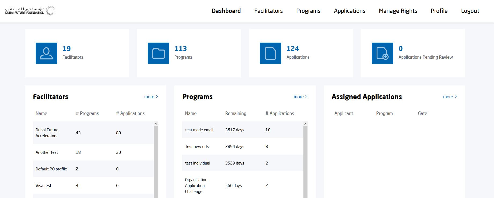
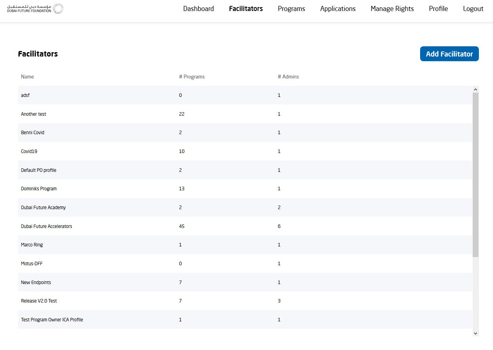

[GENERAL](GENERAL/README.md) > [DF-PROGRAMS](DF-Programs/README.md) > **[FACILITATOR](DF-Programs/programowner.md)**

## FACILITATOR  

Visit [Dubai Future Programs](https://programs.dubaifuture.gov.ae)

<table>
  <thead>
  </thead>
  <tbody>
    <tr>
      <tr><td colspan="3"><b>Register/Login</b></td>      
    </tr>
    <tr>
      <td style="text-align: left">
<b>Step 1:</b>
Click the "Facilitators" tab on the top right.</td>
      <td style="text-align: center"></td>
    </tr>
    <tr>
      <td style="text-align: left">
<b>Step 2:</b>
Here you can see all the current Facilitators and how many Programs they are assigned to, as well as where they have adminrights. Furthermore you can add new facilitators by clicking on "Add Facilitator".</td>
      <td style="text-align: center"></td>
    </tr>
  </tbody>
</table>
