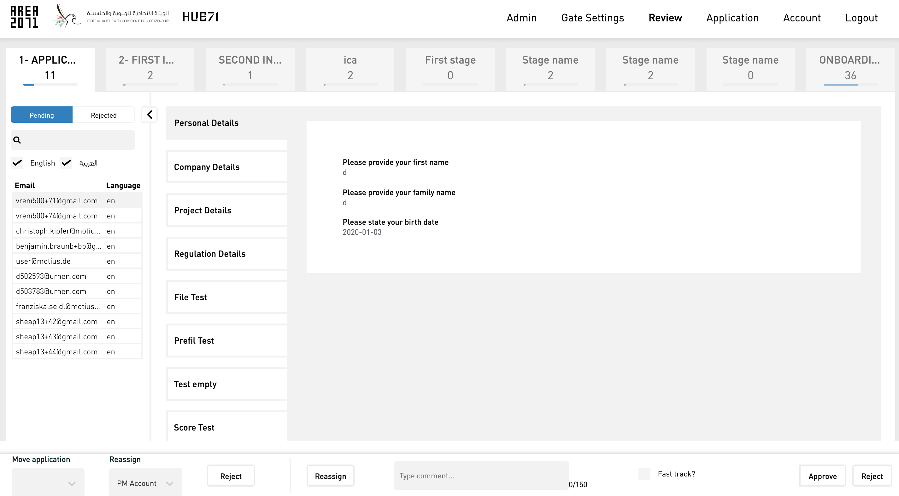
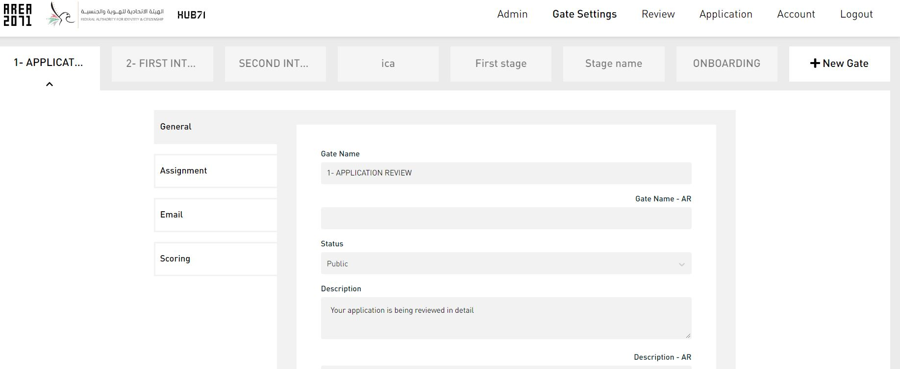
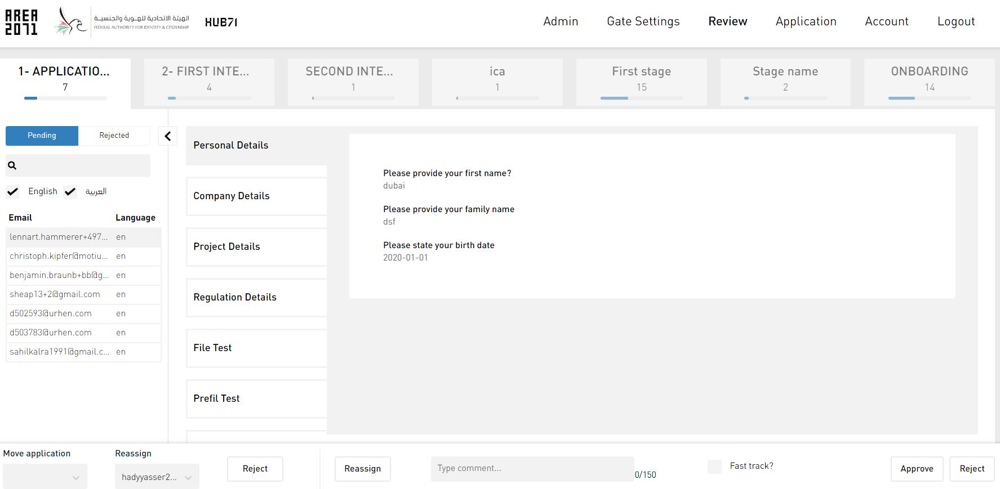
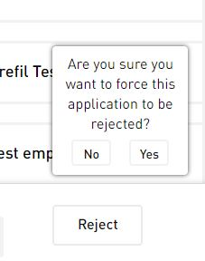
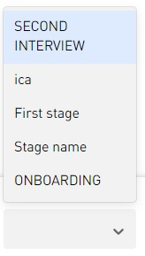

[GENERAL](GENERAL/README.md) > [DF-PROGRAMS](DF-Programs/README.md) > **[REVIEW APPLICATIONS](DF-Programs/programs.md)**

## REVIEW APPLICATIONS  

<table>
  <thead>
  </thead>
  <tbody>
   <tr>
      <tr><td colspan="3"><b>Register/Login</b></td>      
    </tr>
    <tr>
      <td style="text-align: left">
<b></b>
Kanban style review page, where we see all application (or only assigned for reviewers) on each gate.</td>
      <td style="text-align: center"></td>
    </tr>
    <tr>
      <td style="text-align: left">
<b>Step 1:</b>
Click on the "Review" tab on the top right. </td>
      <td style="text-align: center"></td>
    </tr>
        <tr>
      <td style="text-align: left">
<b>Step 2:</b>
Now you can see different applications on different stages. You can either "Approve" or "Reject" an application by clicking on of those buttons on the bottom right.</td>
      <td style="text-align: center"></td>
    </tr>
        <tr>
      <td style="text-align: left">
<b>Step 3:</b>
If you decide to reject an application, you have to approve your rejection twice. </td>
      <td style="text-align: center"></td>
    </tr>
        <tr>
      <td style="text-align: left">
<b>Step 4:</b>
On the bottom left you can move applications between different gates. </td>
      <td style="text-align: center"></td>
    </tr>
  </tbody>
</table>
