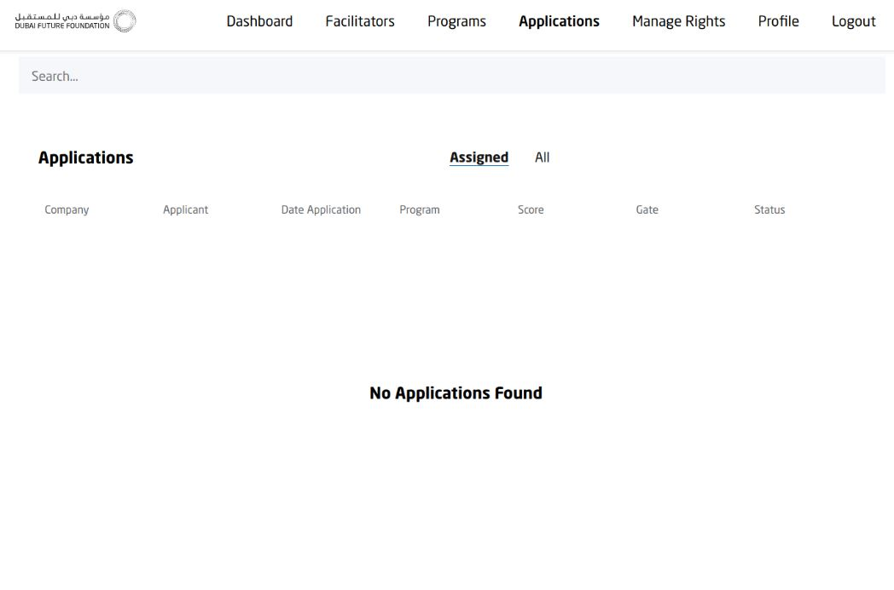
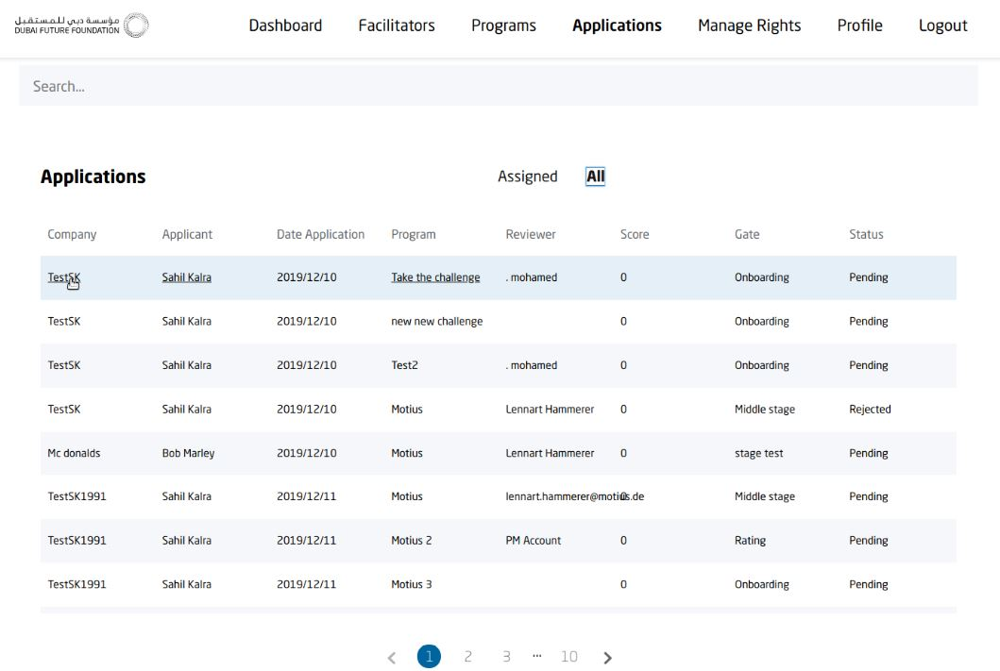
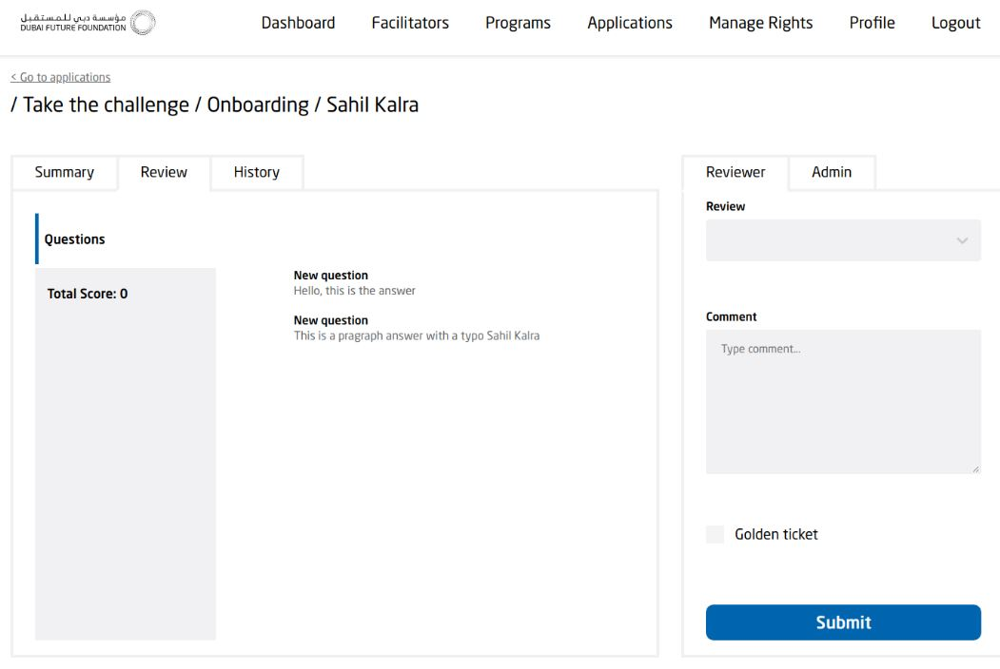
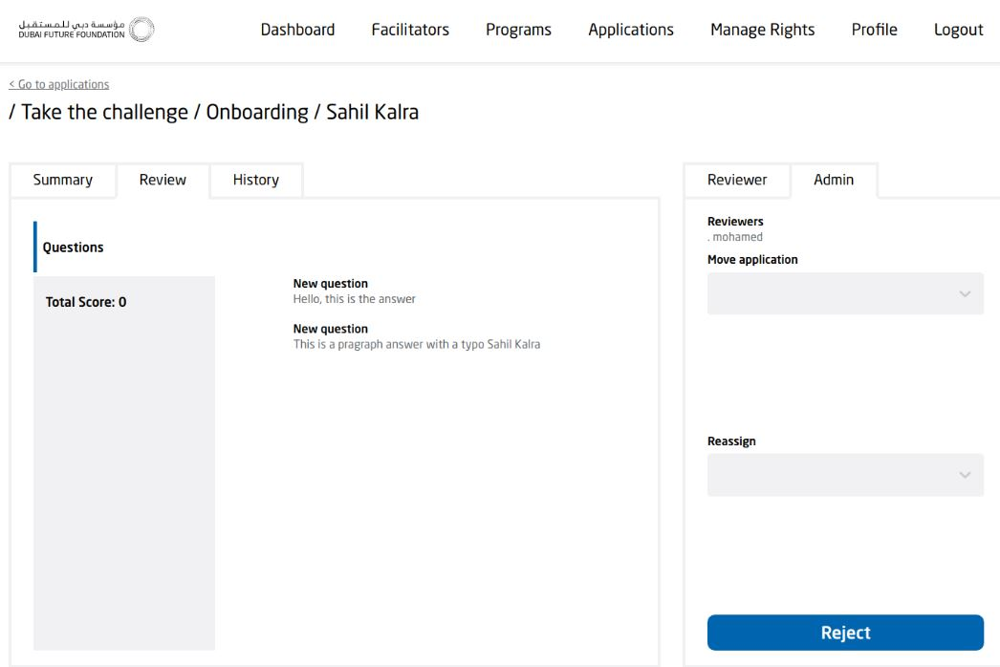

[GENERAL](GENERAL/README.md) > [DF-PROGRAMS](DF-Programs/README.md) > **[REVIEW APPLICATIONS](DF-Programs/reviewapplications.md)**

## REVIEW APPLICATIONS  

<table>
  <thead>
  </thead>
  <tbody>
   <tr>
      <tr><td colspan="3"><b>Register/Login</b></td>      
    </tr>
    <tr>
      <td style="text-align: left">
<b>Step 1:</b>
Click on the "Applications" tab on the top right. Here you cann see all Applications assigned to you.</td>
      <td style="text-align: center"></td>
    </tr>
    <tr>
      <td style="text-align: left">
<b>Step 2:</b>
By clicking on the "All" tab you can see all applications existing.</td>
      <td style="text-align: center"></td>
    </tr>
        <tr>
      <td style="text-align: left">
<b>Step 3:</b>
This is the application review page. As a reviewer you can "Approve" or "Reject" an application. You can add Comments to your review as well.</td>
      <td style="text-align: center"></td>
    </tr>
        <tr>
      <td style="text-align: left">
<b>Step 4:</b>
By clicking on "Admin" on the right side of "Reviewer, you can move application between different gates and/or reassign the application.</td>
      <td style="text-align: center"></td>
    </tr>
  </tbody>
</table>
