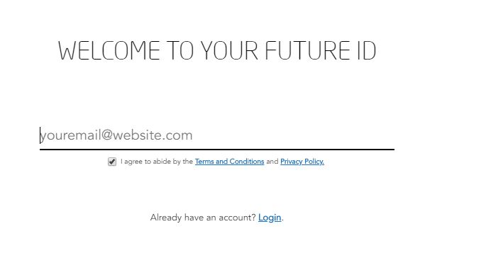

# FUTURE ID
#### TABLE OF CONTENTS

* [WELCOME](#welcome)
* [CREATE AN ACCOUNT](#create-an-account)
* [CREATE AN ORGANISATION](#create-an-organisation)
* [REMOVE A SPECIFIC DEVICE](#remove-a-specific-device)
* [SHARE YOUR CONTACT VIA QR CODE](#share-your-contact-via-qr-code)
* [LOGIN TO A PLATFORM](#login-to-a-platform)
* [USER MANUAL](#user-manual)
* [FREQUENTLY ASKED QUESTIONS](#frequently-asked-questions)

## WELCOME

FUTURE ID is a Single Sign-On (SSO) and Profile Management Service owned and operated by the Dubai Future Foundation. It allows startups, entrepreneurs, academics, researchers, scientists, and the general public to securely and conveniently access a variety of our services.

With a FUTURE ID, you can conveniently access the following platforms:

* [Dubai Future Programs](https://programs.dubaifuture.gov.ae)
* [AREA 2071](https://area2071.ae/app)
* [UAE Regulations Lab](https://apply.reglab.ae)

## CREATE AN ACCOUNT  

Visit [https://id.dubaifuture.gov.ae](https://id.dubaifuture.gov.ae)

<table>
  <thead>
  </thead>
  <tbody>
    <tr>
      <tr><td colspan="3"><b>Login/Register</b></td>      
    </tr>
    <tr>
      <td style="text-align: left"><b>
Step 1:
</b>Click on "Register" and complete your profile</td>
      <td style="text-align: center"></td>
    </tr>
    <tr>
    <td style="text-align: left"><b>
Step 2:
</b>Insert your email address and agree with the Terms and Conditions and Privacy Policy.</td>
    <td style="text-align: center"></td>
    </tr>
    <tr>
    <td style="text-align: left"><b>
Step 3:
</b>Insert a new password and agree with the Terms and Conditions and Privacy Policy.</td>
    <td style="text-align: center"></td>
    </tr>
    <tr>
    <td style="text-align: left"><b>
Step 4:
</b>Enter the verification code which was sent to your email adress. If you didn't get an email yet, click on "Resend Email".</td>
    <td style="text-align: center"></td>
    </tr>
    <tr>
      <tr><td colspan="3">Go to dashboard.</td>      
    </tr>
  </tbody>
</table>

## CREATE AN ORGANISATION  

* Visit [https://id.dubaifuture.gov.ae](https://id.dubaifuture.gov.ae)
* Click on "Login/Register":
  * If you're already signed in with FUTURE ID, you'll automatically be logged in.
  * If you're not signed in with FUTURE ID, you'll be redirected to FUTURE ID to sign in.

  |||
  | ------------- |:-------------:|
  | Click on "ADD ORGANISATION" after finishing with "Login/Register".     | |
  | Insert your Organisation/Company Name. | |   
  | Upload your logo by uploading an image either via drag & drop or browse your files.  | |   
  | Insert a short description of your organisation with maximum 200 letters.| |
  | Insert a long description of your organisation with maximum 1000 letters.  | |
  | Insert your company website URL.| |
  | Insert your Social Media URL. | |  
  | Insert your location by typing your city and country. (e.g. Munich, Germany)  | |
  | Choose your core business between "Physical Product", "Consulting" and "Software".  | |
  | Add Tags here.  | |
  | Add the number of full time employees working in your organisation/company.  | |
  | Insert the incorporation date.  | |
  | Choose your current market stage between "Idea", "Prototype", "Ready for Market" and "Product in Market".  | |
  | Choose your funding type between "Self-Funded", "External Investment" and "Revenue".  | |
  | Insert Members by adding their email address. Make them either to a member or to an admin. | |
  | Go back to dashboard. | |

## REMOVE A SPECIFIC DEVICE  

* Visit [https://id.dubaifuture.gov.ae](https://id.dubaifuture.gov.ae)
* Click on "Login/Register":
  * If you're already signed in with FUTURE ID, you'll automatically be logged in.
  * If you're not signed in with FUTURE ID, you'll be redirected to FUTURE ID to sign in.

    |||
    | ------------- |:-------------:|  
    | Click on the hamburger button in the top right corner.  | |   
    | Click on "GO TO SETTINGS"  | |   
    | Remove one of the devices listed below "DEVICES".  | |   
    | Confirm by clicking "REMOVE DEVICE".  | |   
    | DONE | |      
    | Go back to dashboard. | |

## SHARE YOUR CONTACT VIA QR CODE  
* Visit [https://id.dubaifuture.gov.ae](https://id.dubaifuture.gov.ae) on your smartphone.
* Click on "Login/Register":
  * If you're already signed in with FUTURE ID, you'll automatically be logged in.
  * If you're not signed in with FUTURE ID, you'll be redirected to FUTURE ID to sign in.

  |||
  | ------------- |:-------------:|  
  | Click on the hamburger button in the top right corner.  | |   
  | Click on "SHARE YOUR PROFILE"  | |
  | Now you can share the QR Code, which is shown on your display, with others.  | |       
  | Go back to dashboard. | |

## LOGIN TO A PLATFORM

* Visit one of platforms listed above
* Click on "Login/Register":
  * If you're already signed in with FUTURE ID, you'll automatically be logged in.
  * If you're not signed in with FUTURE ID, you'll be redirected to FUTURE ID to sign in.
  ---

## USER MANUAL

#### Account Setup and Management

* [How do I create a FUTURE ID?](link.md)
* [How do I fill out and manage my profile?](link.md)
* [Which fields are mandatory and which are optional?](link.md)
* [How can I share my profile with others?](link.md)

#### Organizations

* [How do I create an organization?](link.md)
* [How can I add members to my organization?](link.md)
* [How do I make a member of my organization an admin?](link.md)
* [How can I delete my organization?](link.md)
* [What information is private and what is public?](link.md)

#### Account Security

* [How do I turn on Two-Factor Authentication for additional security?](link.md)
* [How do I view and manage the devices currently logged into my account?](link.md)
* [I received an email with a sign-in notification. What is this?](link.md)

#### Logging Into Platforms

* [How do I login to a platform with my FUTURE ID?](link.md)
* [How do I see which platforms have access to my data?](link.md)
* [How do I revoke a platform's access to my data?](link.md)

___

## FREQUENTLY ASKED QUESTIONS

* **Can anyone create a FUTURE ID?** 
  *Yes, anyone can create a FUTURE ID and access any of our platforms.*

* **How is FUTURE ID different from other Single Sign-On (SSO) services?**
  *FUTURE ID gives you access to platforms owned and operated by Dubai Future Foundation. Creating a free account keeps you connected to our global ecosystem of entrepreneurs, startups, academics, researchers, and scientists, and gives you access to many of our programs such as AREA 2071 and Dubai Future Accelerators.*
