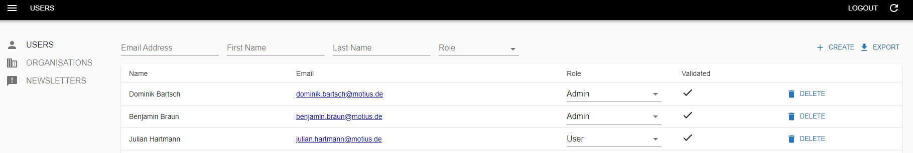
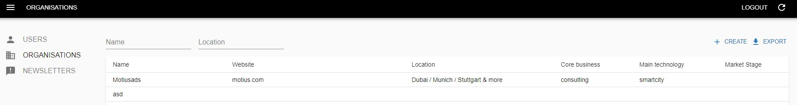
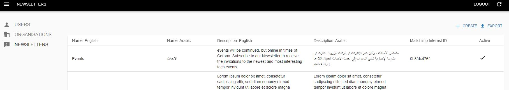

## ADMIN IN GENERAL  

Visit [https://dff-future-id-admin-develop.apps.moti.us](https://dff-future-id-admin-develop.apps.moti.us)

<table>
  <thead>
  </thead>
  <tbody>
    <tr>
      <tr><td colspan="3"><b>Login/Register.</b></td>
    </tr>
    <tr>
    <td style="text-align: left">
<b>USERS</b>
Here you can change Roles between "Admin" and "User". You can see "Name", "E-Mail" and if an Account is "Validated". Furthermore you can "DELETE" Accounts here.</td>
    <td style="text-align: center"></td>
    </tr>
    <tr>
    <td style="text-align: left">
<b>ORGANISATIONS</b>
Here you cann see "Name", "Website", "Location", "Core business", "Main technology" and "Market Stage" of an Organisation.</td>
    <td style="text-align: center"></td>
    </tr>
    <tr>
    <td style="text-align: left">
<b>NEWSLETTERS</b>
Here you can see "Name", "Description", "Mailchimp Interest ID" and the "Active" status of a newsletter.</td>
    <td style="text-align: center"></td>
    </tr>
    </tbody>
</table>
