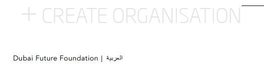
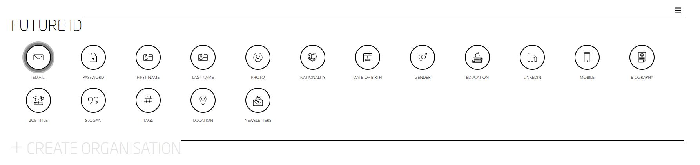
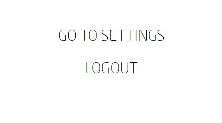
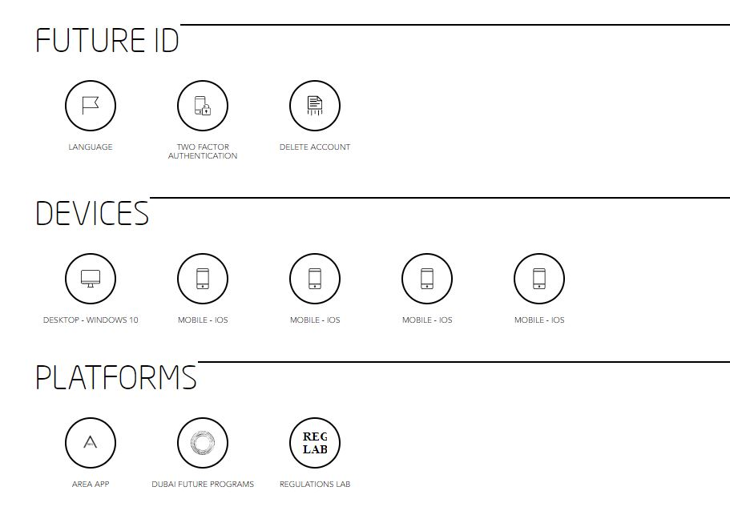
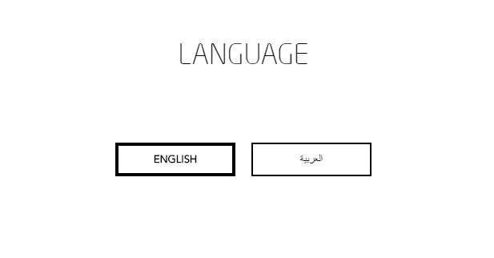

[GENERAL](/WIKI_README.md) > [FUTURE ID](FUTURE ID/README.md) > **[CHANGE PLATFORM LANGUAGE](FUTURE ID/changeplatformlanguage.md)**

## CHANGE PLATFORM LANGUAGE  

Visit [https://id.dubaifuture.gov.ae](https://id.dubaifuture.gov.ae)

<table>
  <thead>
  </thead>
  <tbody>
    <tr>
      <tr><td colspan="3"><b>You have two options to set your language.</b></td>
    </tr>
    <tr>
    <td style="text-align: left">
<b>Change Language Option 1</b>
On the bottom left you can change between English and Arabic language. If you have changed to Arabic, you can change it back by clicking on English on the bottom right.</td>
    <td style="text-align: center"></td>
    </tr>
    <td style="text-align: left">
<b>Change Language Option 2 Step 1:</b>
Click on the hamburger menu on the top right.</td>
    <td style="text-align: center"></td>
    </tr>
    <tr>
    <td style="text-align: left">
<b>Step 2:</b>
Click on "GO TO SETTINGS".</td>
    <td style="text-align: center"></td>
    </tr>
    <tr>
    <td style="text-align: left">
<b>Step 3:</b>
Click on "LANGUAGE".</td>
    <td style="text-align: center"></td>
    </tr>
    <tr>
    <td style="text-align: left">
<b>Step 4:</b>
Here you can change between English and Arabic language.</td>
    <td style="text-align: center"></td>
    </tr>
    <tr>
      <tr><td colspan="3"><b>Your language has been changed.</b></td>
    </tr>
    </tbody>
</table>

