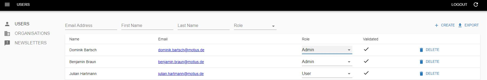
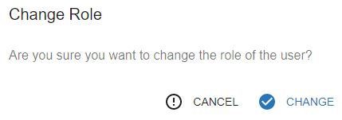

## CHANGE USER ROLE  

Visit [https://id.dubaifuture.gov.ae](https://id.dubaifuture.gov.ae)

<table>
  <thead>
  </thead>
  <tbody>
    <tr>
      <tr><td colspan="3"><b>Login/Register.</b></td>
    </tr>
    <tr>
    <td style="text-align: left">
<b>Step 1:</b>
Under the "USERS" tab you can now switch within the "Role" column between "Admin" and "User".</td>
    <td style="text-align: center"></td>
    </tr>
    <tr>
    <td style="text-align: left">
<b>Step 2:</b>
Confirm Role change by clicking "Change" on the bottom right.</td>
    <td style="text-align: center"></td>
    </tr>
    <tr>
    <tr><td colspan="3"><b>Role has successfully been changed.</b></td>
    </tr>
    </tbody>
</table>
