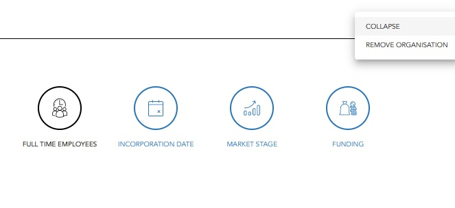
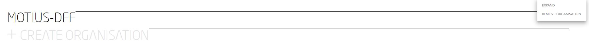

## COLLAPSE FID SECTION   

Visit [https://dff-future-id-frontend-develop.apps.moti.us](https://dff-future-id-frontend-develop.apps.moti.us)

<table>
  <thead>
  </thead>
  <tbody>
    <tr>
      <tr><td colspan="3"><b>Login/Register.</b></td>
    </tr>
    <tr>
    <td style="text-align: left">
<b>Step 1:</b>
Click on the icon with thre points in a row on the right side of each Organisation.</td>
    <td style="text-align: center"></td>
    </tr>
    <tr>
    <td style="text-align: left">
<b>Step 2:</b>
Now you can choose between "COLLAPSE" and "REMOVE ORGANISATION".</td>
    <td style="text-align: center"></td>
    </tr>
    <tr>
    <td style="text-align: left">
<b>Step 3:</b>
Click on "COLLAPSE" to collapse the Organisation you choose.</td>
    <td style="text-align: center"></td>
    </tr>
    <tr>
    <td style="text-align: left">
<b>Step 4:</b>
Click again on the hamburger menu and on "EXPAND" to expand the Organisation you collapsed before.</td>
    <td style="text-align: center"></td>
    </tr>
    <tr>
      <tr><td colspan="3"><b>Your FID Section has been successfully collapsed and expanded.</b></td>
    </tr>
    </tbody>
</table>
