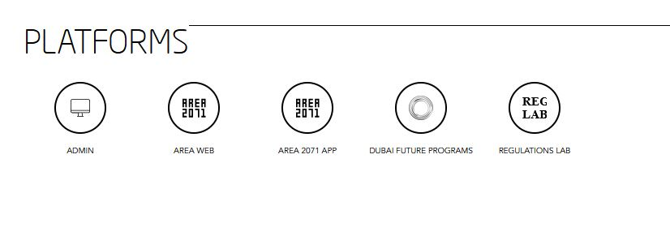

## CONNECTED PLATFORMS   

Visit [https://id.dubaifuture.gov.ae](https://id.dubaifuture.gov.ae)

<table>
  <thead>
  </thead>
  <tbody>
    <tr>
      <tr><td colspan="3"><b>Login/Register.</b></td>
    </tr>
    <tr>
    <td style="text-align: left">
<b>Step 1:</b>
Click on the hamburger menu on the top right.</td>
    <td style="text-align: center"></td>
    </tr>
    <tr>
    <td style="text-align: left">
<b>Step 2:</b>
Click on "GO TO SETTINGS".</td>
    <td style="text-align: center"></td>
    </tr>
    <tr>
    <td style="text-align: left">
<b>Step 3:</b>
Here you can see all your connected Platforms.</td>
    <td style="text-align: center"></td>
    </tr>
    <tr>
    <td style="text-align: left">
<b>Connection with Future ID</b>
Here you can see an example of the overlay with REGULATIONS LAB. All the platforms shown are connected with Future ID. Click on the specific icon from the platform you want to get directed to.</td>
    <td style="text-align: center"></td>
    </tr>
    <tr>
      <tr><td colspan="3"><b>Go back to dashboard.</b></td>
    </tr>
    </tbody>
</table>