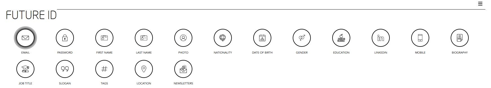

[GENERAL](/WIKI_README.md) > [FUTURE ID](FUTURE ID/README.md) > **[CREATE ACCOUNT](FUTURE ID/createanaccount.md)**

## CREATE ACCOUNT 

Visit [https://id.dubaifuture.gov.ae](https://id.dubaifuture.gov.ae)

<table>
  <thead>
  </thead>
  <tbody>
    <tr>
      <td style="text-align: left">
<b>Step 1:</b>
Click on "register" and complete your profile.</td>
      <td style="text-align: center"></td>
    </tr>
    <tr>
    <td style="text-align: left">
<b>Step 2:</b>
Insert your email address and agree with the Terms & Conditions and Privacy Policy.</td>
    <td style="text-align: center"></td>
    </tr>
    <tr>
    <td style="text-align: left">
<b>Step 3:</b>
Insert a new password and agree with the Terms & Conditions and Privacy Policy.</td>
    <td style="text-align: center"></td>
    </tr>
    <tr>
    <td style="text-align: left">
<b>Step 4:</b>
Enter the verification code which was sent to your email adress. If you didn't get an email yet, click on "Resend Email".</td>
    <td style="text-align: center"></td>
    </tr>
    <tr>
    <td style="text-align: left">
<b>Step 5:</b>
Now you are at the Future ID dashboard. Here you can easily manage all your data at one place.</td>
    <td style="text-align: center"></td>
    </tr>
  </tbody>
</table>