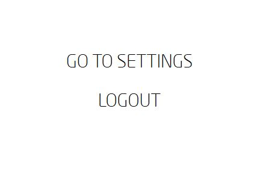

## DELETE ACCOUNT  

Visit [https://id.dubaifuture.gov.ae](https://id.dubaifuture.gov.ae)

<table>
  <thead>
  </thead>
  <tbody>
    <tr>
      <tr><td colspan="3"><b>Login/Register.</b></td>
    </tr>
    <tr>
    <td style="text-align: left">
<b>Step 1:</b>
Click on the hamburger menu on the top right.</td>
    <td style="text-align: center"></td>
    </tr>
    <tr>
    <td style="text-align: left">
<b>Step 2:</b>
Click on "GO TO SETTINGS".</td>
    <td style="text-align: center"></td>
    </tr>
    <tr>
    <td style="text-align: left">
<b>Step 3:</b>
Click on "DELETE ACCOUNT" to continue with your deletion.</td>
    <td style="text-align: center"></td>
    </tr>
    <tr>
    <td style="text-align: left">
<b>Step 4:</b>
Confirm your deletion by clicking "DELETE ACCOUNT".</td>
    <td style="text-align: center"></td>
    </tr>
    <tr>
      <tr><td colspan="3"><b>Your account has successfully been deleted.</b></td>
    </tr>
    </tbody>
</table>
