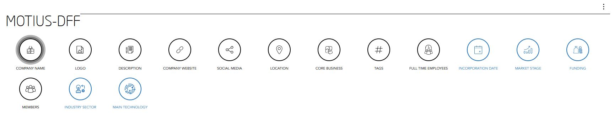

[GENERAL](/WIKI_README.md) > [FUTURE ID](FUTURE ID/README.md) > **[MANAGE YOUR DATA](FUTURE ID/editdatavalues.md)**

## MANAGE YOUR DATA   

Visit [https://id.dubaifuture.gov.ae](https://id.dubaifuture.gov.ae)

<table>
  <thead>
  </thead>
  <tbody>
    <tr>
    <td style="text-align: left">
<b>Edit Values</b>
To edit values, you simply click on one of the Icons where you want to change information. Afterwards you can either go back to your dashboard, or change further informations.</td>
    <td style="text-align: center"></td>
    </tr>
    <tr>
    <td style="text-align: left">
<b>Example</b>
For instance, if you click on Social Media, the shown overlay screen will show up to edit values of your Social Media.</td>
    <td style="text-align: center"></td>
    </tr>
    <tr>
      <tr><td colspan="3"><b>Values have been edited.</b></td>
    </tr>
    </tbody>
</table>
