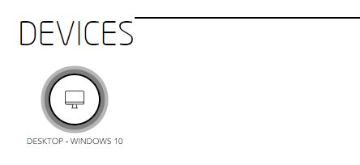
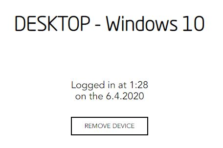

## REMOVE A SPECIFIC DEVICE  

Click on "Login/Register":
  * If you're already signed in with FUTURE ID, you'll automatically be logged in.
  * If you're not signed in with FUTURE ID, you'll be redirected to FUTURE ID to sign in.

<table>
  <thead>
  </thead>
    <tbody>
    <tr>
      <tr><td colspan="3"><b>Login/Register</b></td>      
    </tr>
    <tr>
      <td style="text-align: left">
<b>Step 1:</b>
Click on the hamburger menu in the top right corner.</td>
      <td style="text-align: center"></td>
    </tr>
    <tr>
    <td style="text-align: left">
<b>Step 2:</b>
Click on "GO TO SETTINGS"</td>
    <td style="text-align: center"></td>
    </tr>
    <tr>
    <td style="text-align: left">
<b>Step 3:</b>
Remove one of the devices listed below "DEVICES". **Note: your current device is the one at the beginning of the row, so do not log yourself out by removing your current active device.**</td>
    <td style="text-align: center"></td>
    </tr>
    <tr>
    <td style="text-align: left">
<b>Step 4:</b>
Confirm by clicking "REMOVE DEVICE".</td>
    <td style="text-align: center"></td>
    </tr>
    <tr>
    <td style="text-align: center" colspan="3"></td>
    </tr>
    <tr>
      <tr><td colspan="2">Go to dashboard.</td>      
    </tr>
  </tbody>
</table>
