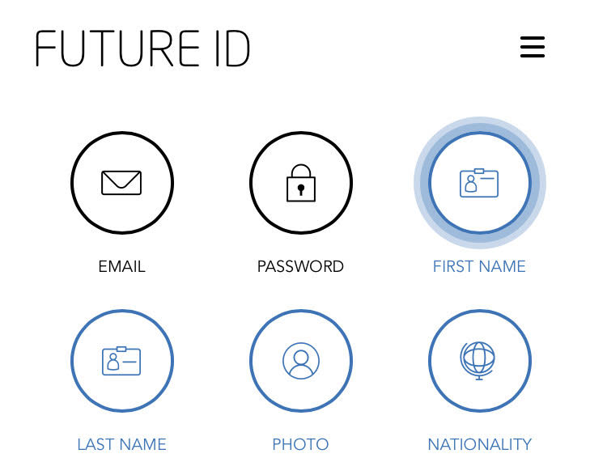

[GENERAL](GENERAL/README.md) > [FUTURE ID](FUTURE ID/README.md) > **[SHARE YOUR CONTACT VIA QR CODE](FUTURE ID/shareyourcontactviaqrcode.md)**

## SHARE YOUR CONTACT VIA QR CODE  

Visit [https://id.dubaifuture.gov.ae](https://id.dubaifuture.gov.ae) **on your smartphone.**
**It is essential to use a smartphone, because the QR code is only available on mobile devices!**

Click on "Login/Register":
  * If you're already signed in with FUTURE ID, you'll automatically be logged in.
  * If you're not signed in with FUTURE ID, you'll be redirected to FUTURE ID to sign in.

<table>
  <thead>
  </thead>
<tbody>
  <tr>
    <tr><td colspan="3"><b>Login/Register</b></td>      
  </tr>
  <tr>
    <td style="text-align: left">
<b>Step 1:</b>
Click on the hamburger button in the top right corner.</td>
    <td style="text-align: center"></td>
  </tr>
  <tr>
  <td style="text-align: left">
<b>Step 2:</b>
Click on "SHARE YOUR PROFILE"</td>
  <td style="text-align: center"></td>
  </tr>
  <tr>
  <td style="text-align: left">
<b>Step 3:</b>
Share Contact via QR Code Step</td>
  <td style="text-align: center"></td>
  </tr>
  <tr>
    <tr><td colspan="2">Go to dashboard.</td>      
  </tr>
</tbody>
</table>
