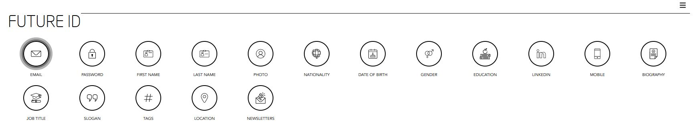
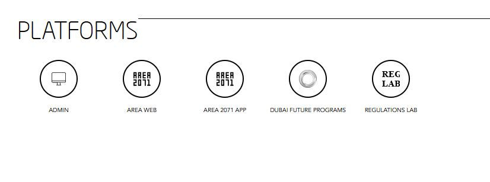
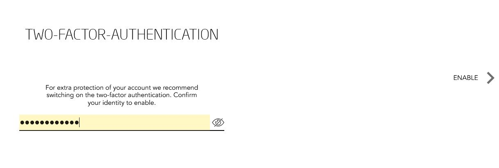
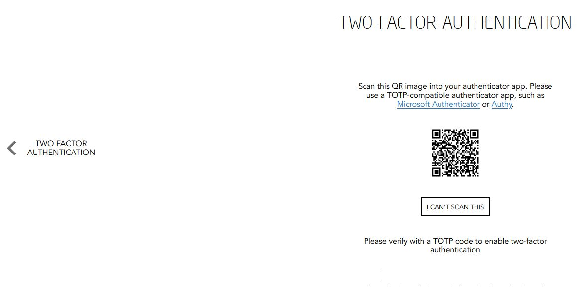
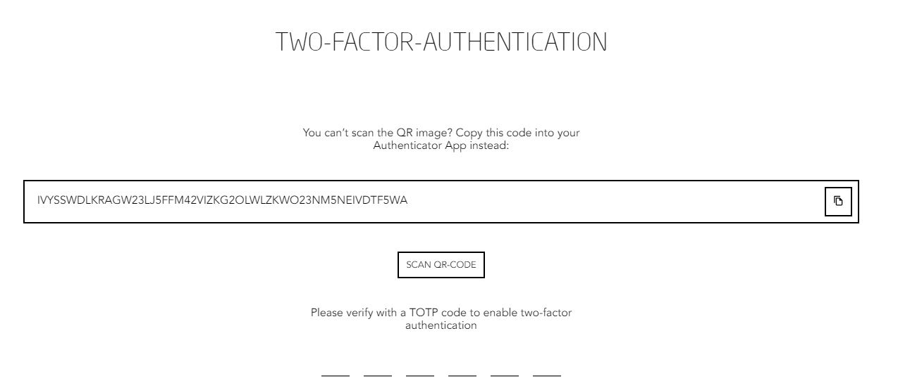

## SETUP TWO-FACTOR AUTHENTICATION  

Visit [https://id.dubaifuture.gov.ae](https://id.dubaifuture.gov.ae)

<table>
  <thead>
  </thead>
  <tbody>
    <tr>
      <tr><td colspan="3"><b>Login/Register.</b></td>
    </tr>
    <tr>
    <td style="text-align: left">
<b>Step 1:</b>
Click on the hamburger bar on the top right.</td>
    <td style="text-align: center"></td>
    </tr>
    <tr>
    <td style="text-align: left">
<b>Step 2:</b>
Click on "GO TO SETTINGS".</td>
    <td style="text-align: center"></td>
    </tr>
    <tr>
    <td style="text-align: left">
<b>Step 3:</b>
Click on "TWO FACTOR AUTHETICATION".</td>
    <td style="text-align: center"></td>
    </tr>
    <tr>
    <td style="text-align: left">
<b>Step 4:</b>
For extra protection of your account type into the yellow line your Password before switching on the two-factor authentication.</td>
    <td style="text-align: center"></td>
    </tr>
    <tr>
    <td style="text-align: left">
<b>Step 5:</b>
Now doenload and use a TOTP-compatible authenticator app on your smartphone, such as Microsoft Authenticator or Authy. Afterwards scan the QR image into your authenticator app.</td>
    <td style="text-align: center"></td>
    </tr>
    <tr>
    <td style="text-align: left">
<b>Step 6:</b>
You will get a 6 digit backup code in your authenticator app on your smartphone. Copy and paste it into Future ID to continue.</td>
    <td style="text-align: center"></td>
    </tr>
    <tr>
    <td style="text-align: left">
<b>Step 7:</b>
If you cannot scan the QR Code shown 2 steps before, you can copy and paste the backup code as well into your authenticator app on your smarthpone and afterwards continue with Step 6.</td>
    <td style="text-align: center"></td>
    </tr>
    <tr>
      <tr><td colspan="3"><b>TWO FACTOR AUTHENTICATION has successfully been enabled.</b></td>
    </tr>
    </tbody>
</table>