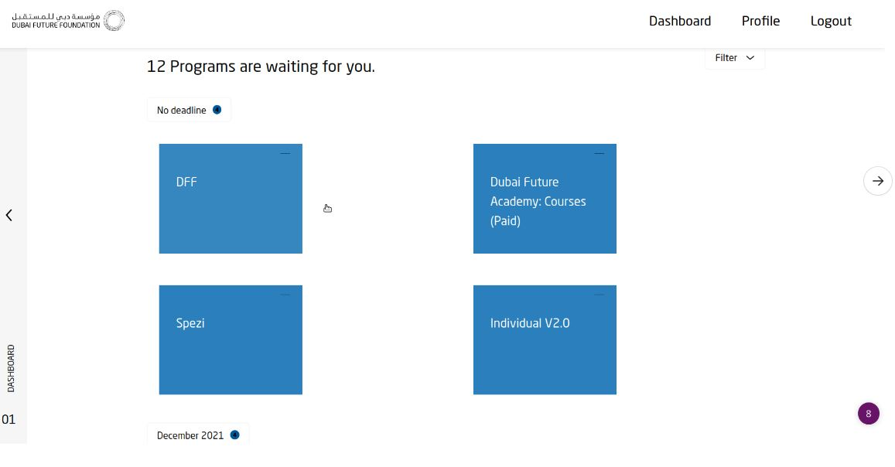
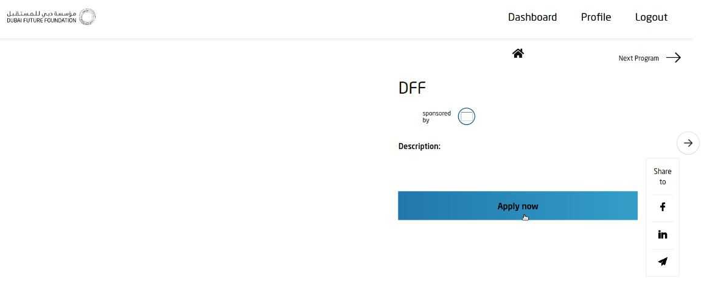
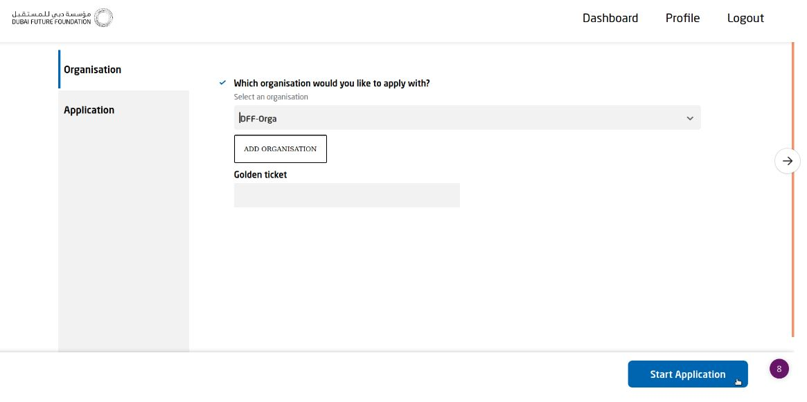
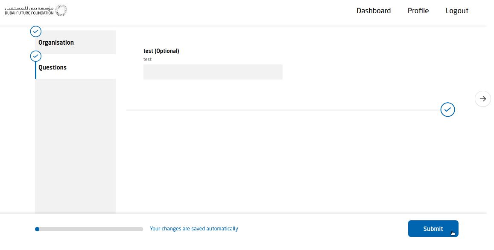
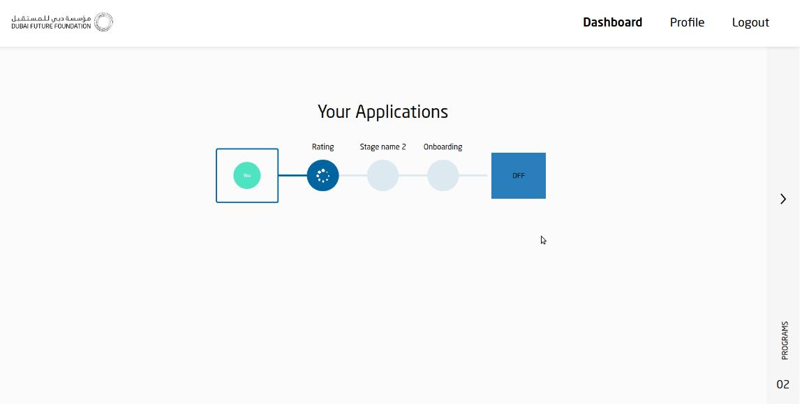

[GENERAL](GENERAL/README.md) > [PROGRAMS](PROGRAMS/README.md) > **[APPLICATION TO A PROGRAM](PROGRAMS/applicationtoaprogram.md)**

## APPLICATION TO A PROGRAM  

Visit [Dubai Future Programs](https://programs.dubaifuture.gov.ae)

<table>
  <thead>
  </thead>
  <tbody>
   <tr>
      <tr><td colspan="3"><b>Register/Login</b></td>      
    </tr>
    <tr>
      <td style="text-align: left">
<b>Step 1:</b>
Click on Applications to get to the Programs you can apply for. Afterwards click on the Program you want to apply for.</td>
      <td style="text-align: center"></td>
    </tr>
    <tr>
      <td style="text-align: left">
<b>Step 2:</b>
Here you can see the Program you choose. Click on "Apply now" to start your application.</td>
      <td style="text-align: center"></td>
    </tr>
    <tr>
      <td style="text-align: left">
<b>Step 3:</b>
Choose either an Organisation by licking on the drop down menu, or create a new organisation by clicking on "ADD ORGANISATION". Afterwards click "Start Application".</td>
      <td style="text-align: center"></td>
    </tr>
    <tr>
      <td style="text-align: left">
<b>Step 4:</b>
Fill out all the required informations of your application and click on "Submit".</td>
      <td style="text-align: center"></td>
    </tr>
    <tr>
      <td style="text-align: left">
<b>Step 5:</b>
You have succesfully applied for a program. You cann see your Application status in the tab "Dashboard".</td>
      <td style="text-align: center"></td>
    </tr>
  </tbody>
</table>

