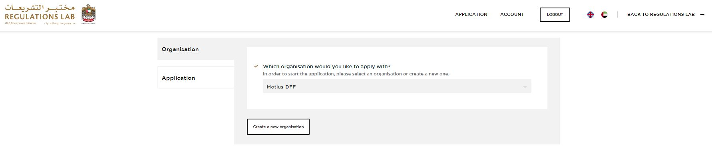
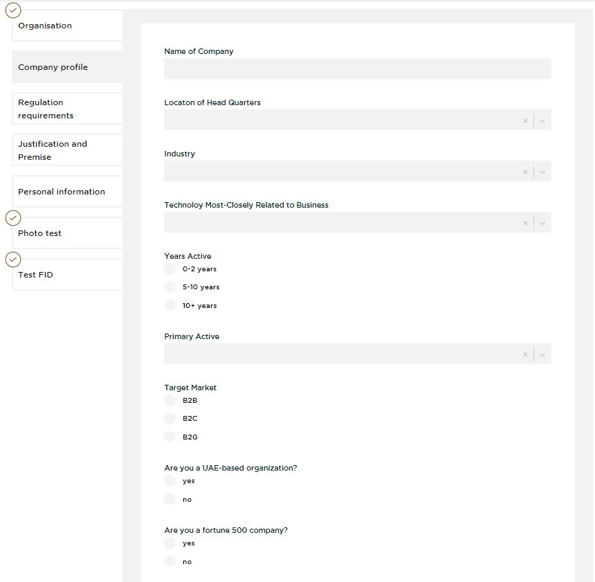
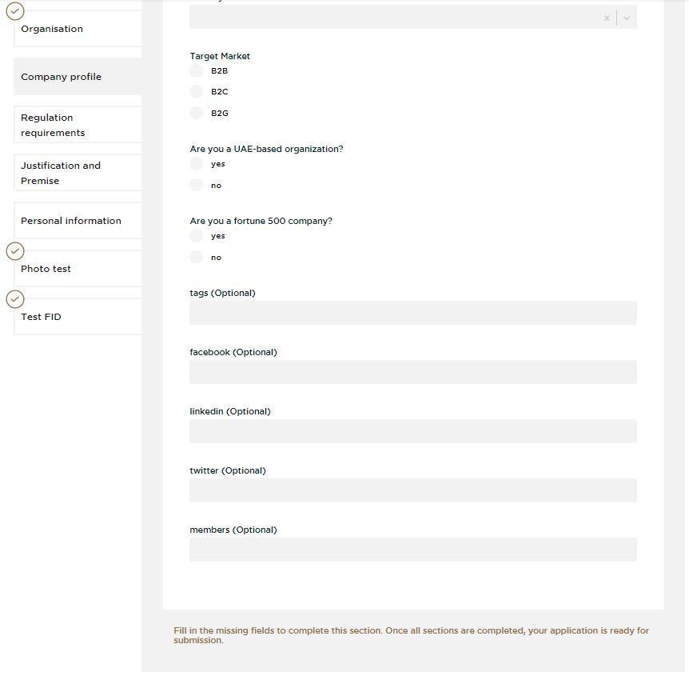
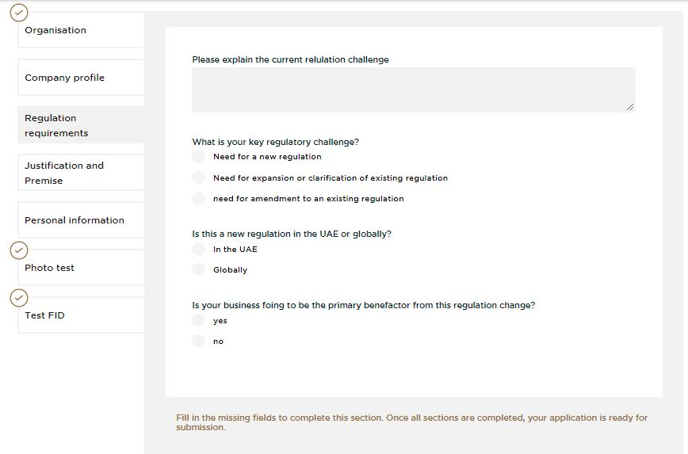
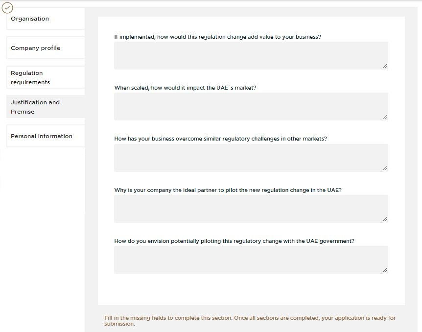
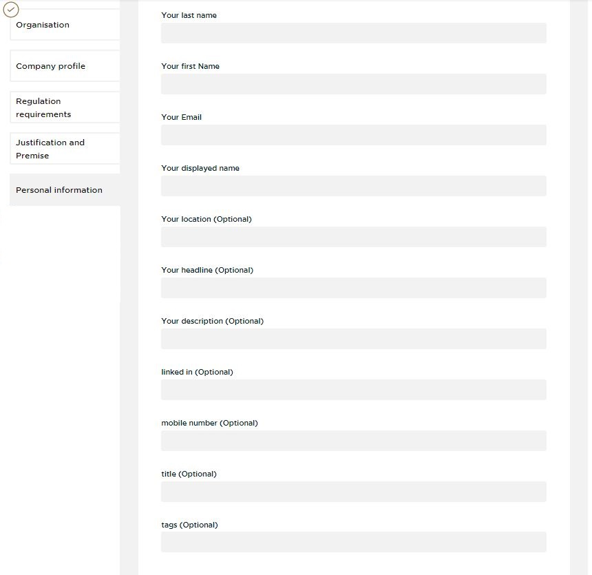

## APPLICATION  

Visit [https://dff-reglab-platform-frontend-develop.apps.moti.us/](https://dff-reglab-platform-frontend-develop.apps.moti.us/)

<table>
  <thead>
  </thead>
  <tbody>
    <tr>
      <td style="text-align: left">
<b>Step 1:</b>
Click on "APPLY NOW"</td>
      <td style="text-align: center"></td>
    </tr>
    <tr>
    <td style="text-align: left">
<b>Step 2:</b>
Connect with FUTURE ID and aggree with the Terms & Conditions.</td>
    <td style="text-align: center"></td>
    </tr>
    <tr>
    <td style="text-align: left">
<b>Step 3:</b>
Click on "Create a new organisation".</td>
    <td style="text-align: center"></td>
    </tr>
     <tr>
    <td style="text-align: left">
<b>Step 4:</b>
Add informations to your Company profile like "Name of Company", "Location of Head Quarters", "Industry", "Technoloy Most-Closely Related to Business", "Years Active" and "Primary Active".</td>
    <td style="text-align: center"></td>
    </tr>
    <tr>
    <td style="text-align: left">
<b>Step 5:</b>
Furthermore add informations to your Company profile like "Target Market", "Are you a UAE-based organization?", "Are you a fortune 500 company?" and optional you can add tags, facebook, linkedin, twitter and members. .</td>
    <td style="text-align: center"></td>
    </tr>
    <tr>
    <td style="text-align: left">
<b>Step 6:</b>
Insert Regulation requirements. Explain your current regulation challenge and answer the questions.</td>
    <td style="text-align: center"></td>
    </tr>
    <tr>
    <td style="text-align: left">
<b>Step 7:</b>
Add informations to Justification and Premise.</td>
    <td style="text-align: center"></td>
    </tr>
    <tr>
    <td style="text-align: left">
<b>Step 8:</b>
This is your personal information provided and prefilled by your FUTURE ID data.</td>
    <td style="text-align: center"></td>
    </tr>
    <tr>
      <tr><td colspan="3"><b>Submit your application.</b></td>      
    </tr>
  </tbody>
</table>
