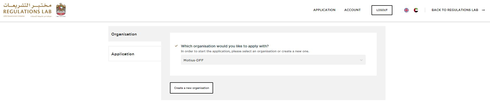
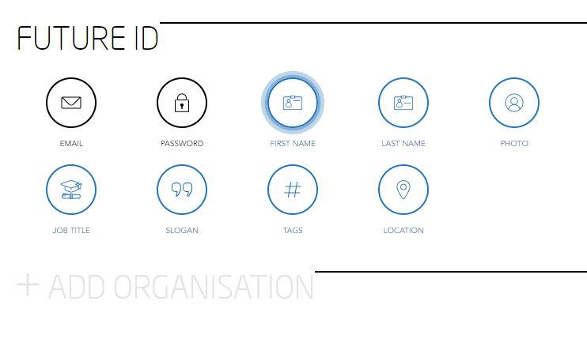

## CREATE ORGANISATION  

Visit [https://dff-reglab-platform-frontend-develop.apps.moti.us](https://dff-reglab-platform-frontend-develop.apps.moti.us/)

<table>
  <thead>
  </thead>
  <tbody>
    <tr>
      <td style="text-align: left">
<b>Step 1:</b>
Click on "APPLY NOW"</td>
      <td style="text-align: center"></td>
    </tr>
    <tr>
    <td style="text-align: left">
<b>Step 2:</b>
Connect with FUTURE ID and aggree with the Terms & Conditions.</td>
    <td style="text-align: center"></td>
    </tr>
    <tr>
    <td style="text-align: left">
<b>Step 3:</b>
Click on "Create a new Organisation".</td>
    <td style="text-align: center"></td>
    </tr>
        <tr>
        <td style="text-align: left">
<b>Step 4:</b>
Click on "ADD ORGANISATION" after finishing with "Login/Register".</td>
        <td style="text-align: center"></td>
      </tr>
      <tr>
      <td style="text-align: left">
<b>Step 5:</b>
Insert your Organisation/Company Name.</td>
      <td style="text-align: center"></td>
      </tr>
      <tr>
      <td style="text-align: left">
<b>Step 6:</b>
Upload your logo by uploading an image either via drag & drop or browse your files.</td>
      <td style="text-align: center"></td>
      </tr>
      <tr>
      <td style="text-align: left">
<b>Step 7:</b>
Insert a short description of your organisation with maximum 200 letters.</td>
      <td style="text-align: center"></td>
      </tr>
      <tr>
        <td style="text-align: left">
<b>Step 8:</b>
Insert a long description of your organisation with maximum 1000 letters.</td>
        <td style="text-align: center"></td>
      </tr>
      <tr>
      <td style="text-align: left">
<b>Step 9:</b>
Insert your company's website URL.</td>
      <td style="text-align: center"></td>
      </tr>
      <tr>
      <td style="text-align: left">
<b>Step 10:</b>
Insert your social media URL.</td>
      <td style="text-align: center"></td>
      </tr>
      <tr>
      <td style="text-align: left">
<b>Step 11:</b>
Insert your location by typing your city and country. (e.g. Munich, Germany)</td>
      <td style="text-align: center"></td>
      </tr>
      <tr>
      <td style="text-align: left">
<b>Step 12:</b>
Choose your core business between "Physical Product", "Consulting" and "Software".</td>
      <td style="text-align: center"></td>
      </tr>
      <tr>
      <td style="text-align: left">
<b>Step 13:</b>
Add Tags here.</td>
      <td style="text-align: center"></td>
      </tr>
      <tr>
      <td style="text-align: left">
<b>Step 14:</b>
Add the number of full time employees working in your organisation/company.</td>
      <td style="text-align: center"></td>
      </tr>
      <tr>
        <td style="text-align: left">
<b>Step 15:</b>
Insert the incorporation date.</td>
        <td style="text-align: center"></td>
      </tr>
      <tr>
      <td style="text-align: left">
<b>Step 16:</b>
Choose your current market stage between "Idea", "Prototype", "Ready for Market" and "Product in Market". </td>
      <td style="text-align: center"></td>
      </tr>
      <tr>
      <td style="text-align: left">
<b>Step 17:</b>
Choose your funding type between "Self-Funded", "External Investment" and "Revenue".</td>
      <td style="text-align: center"></td>
      </tr>
      <tr>
      <td style="text-align: left">
<b>Step 18:</b>
Insert Members by adding their email address. Make them either to a member or to an admin.</td>
      <td style="text-align: center"></td>
      </tr>
        <tr>
      <td style="text-align: left">
<b>Step 19:</b>
After creating an organisation you will be back on your Future ID dashboard. Click now on "Return to RegulationsLab".</td>
      <td style="text-align: center"></td>
      </tr>
    </tbody>
  </table>
