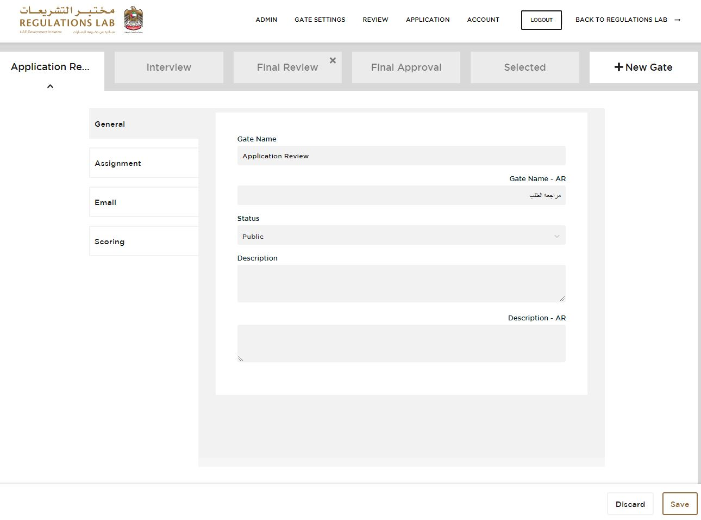
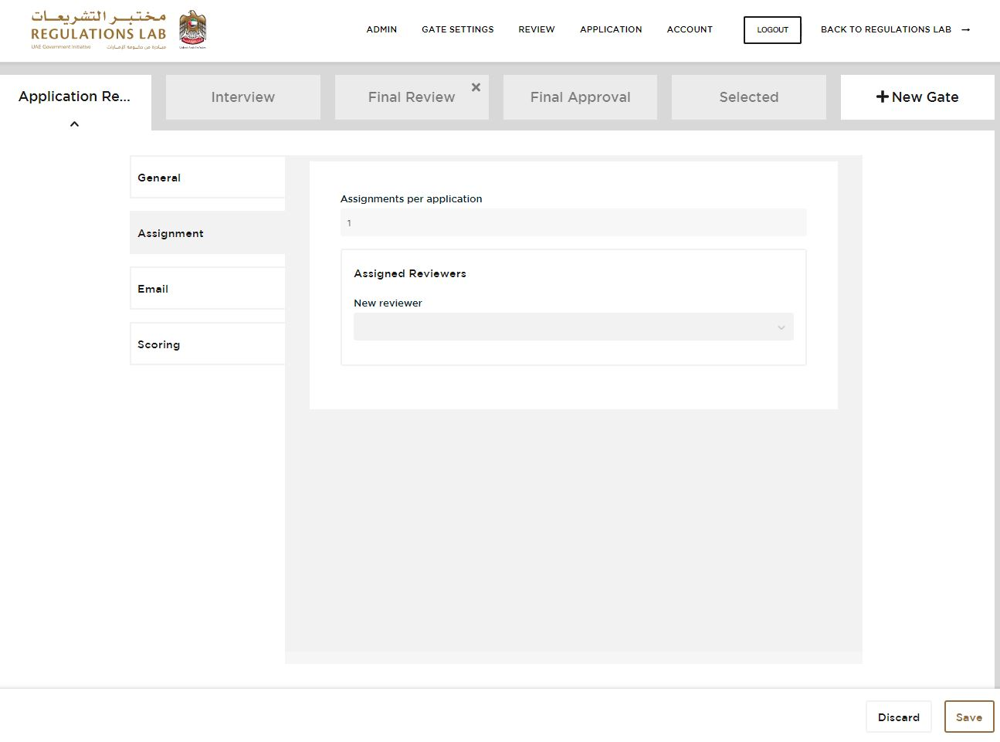
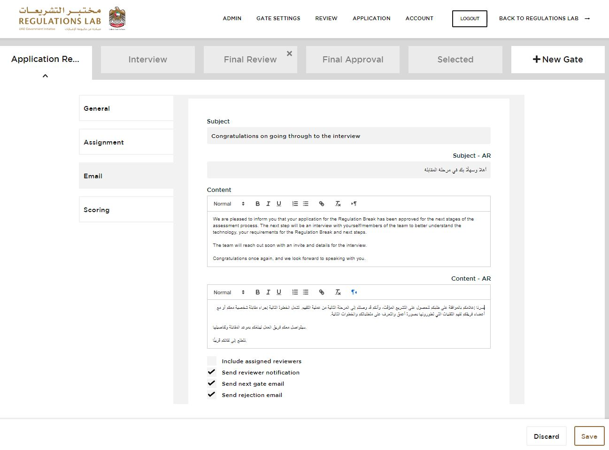
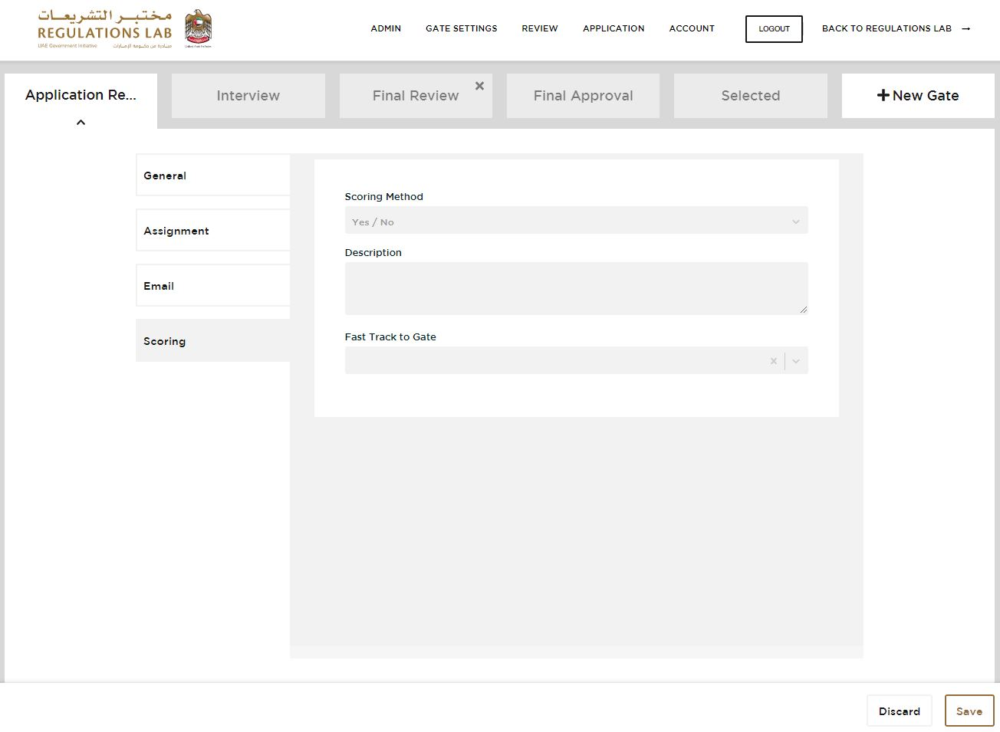

## REVIEW APPLICATION  

Visit [https://reglab.gov.ae](https://reglab.gov.ae)

<table>
  <thead>
  </thead>
  <tbody>
    <tr>
      <td style="text-align: left">
<b>Step 1:</b>
Click on "APPLY NOW" and log into your Future ID Account.</td>
      <td style="text-align: center"></td>
    </tr>
    <tr>
      <td style="text-align: left">
<b>Step 2:</b>
Click on the "Review" tab on the top right. </td>
      <td style="text-align: center"></td>
    </tr>
        <tr>
      <td style="text-align: left">
<b>Step 3:</b>
Now you can see different applications on different stages. You can either "Approve" or "Reject" an application by clicking on of those buttons on the bottom right.</td>
      <td style="text-align: center"></td>
    </tr>
        <tr>
      <td style="text-align: left">
<b>Step 4:</b>
If you decide to reject an application, you have to approve your rejection twice. </td>
      <td style="text-align: center"></td>
    </tr>
  </tbody>
</table>
