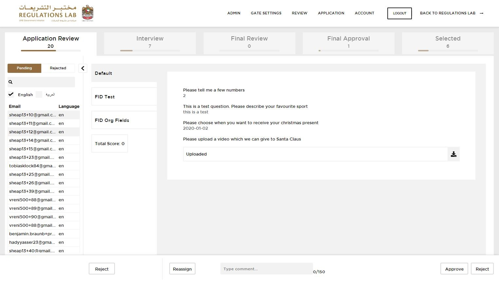
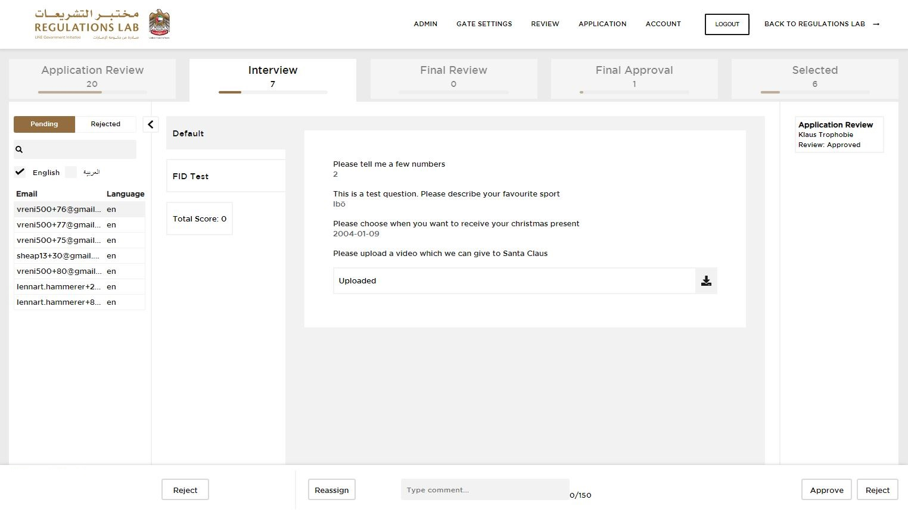
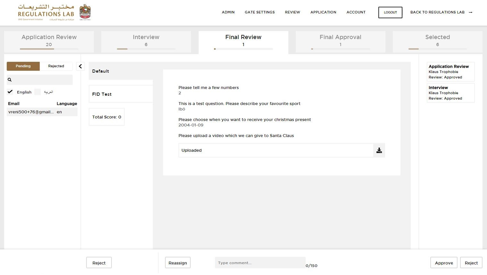
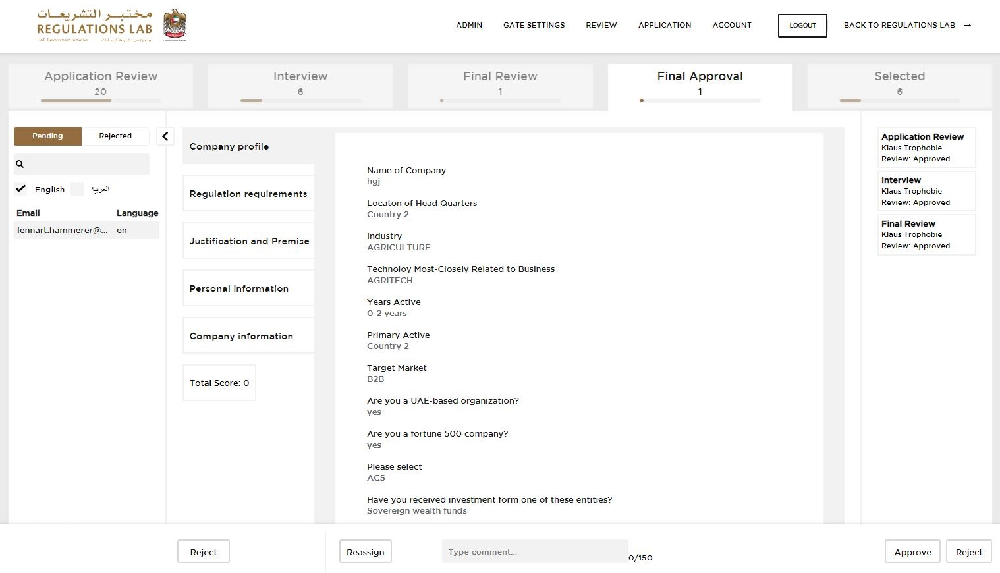

## REVIEW APPLICATION  

Visit [https://reglab.gov.ae](https://reglab.gov.ae)

<table>
  <thead>
  </thead>
  <tbody>
    <tr>
      <td style="text-align: left">
<b>Step 1:</b>
Click on the "Review" tab on the top right.  Now you can see different applications on different stages. You can either "Approve" or "Reject" an application by clicking on of those buttons on the bottom right. If you "Approve" an Application from the shown "Application Review" it goes further to the next stage. If you decide to "Reject", it will be deleted.</td>
      <td style="text-align: center"></td>
    </tr>
    <tr>
      <td style="text-align: left">
<b>Step 2:</b>
Here you can review the "Interview" stage. If you "Approve" an Application from the shown "Interview" stage it goes further to the next stage. If you decide to "Reject", it will be deleted.</td>
      <td style="text-align: center"></td>
    </tr>
        <tr>
      <td style="text-align: left">
<b>Step 3:</b>
Here you can review the "Final Review" stage. If you "Approve" an Application from the shown "Final Review" stage it goes further to the next stage. If you decide to "Reject", it will be deleted.</td>
      <td style="text-align: center"></td>
    </tr>
        <tr>
      <td style="text-align: left">
<b>Step 4:</b>
In the last stage "Selected" you can see your selected Application you review.</td>
      <td style="text-align: center"></td>
    </tr>
  </tbody>
</table>
