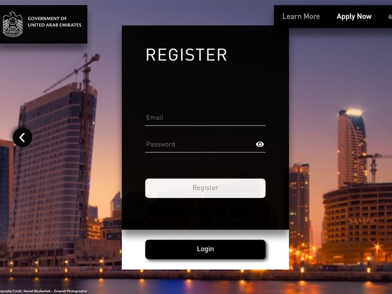
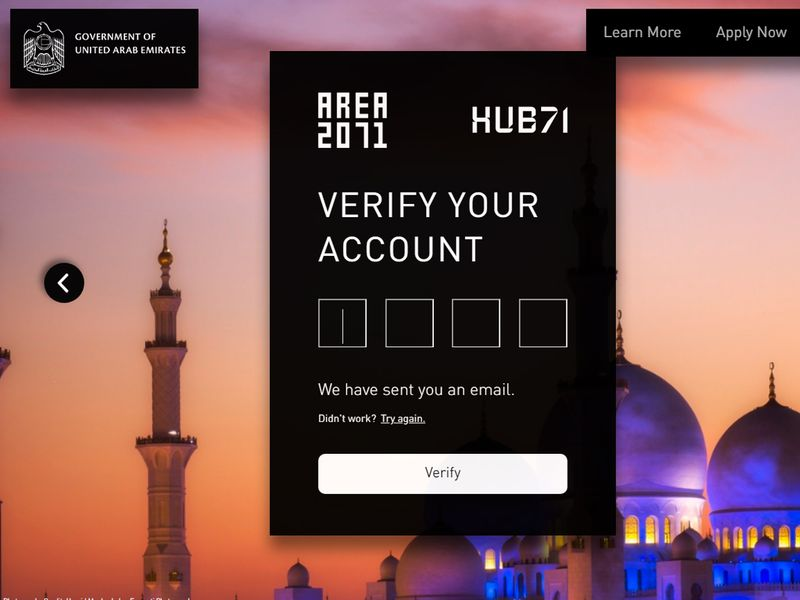

# UAE GOLDEN VISA
#### TABLE OF CONTENTS

* [WELCOME](#short-explanation-to-visa)
* [APPLICATION](#application)
* [SUBMIT AN APPLICATION](#submit-an-application)
* [REVIEW](#review)
* [REVIEW AN APPLICATION](#review-an-application)
* [FREQUENTLY ASKED QUESTIONS](#frequently-asked-questions)

## WELCOME  

The startup ecosystem in the United Arab Emirates has progressed at an unprecedented speed. We are now home to an ever-growing technology startup ecosystem, attracting the best and brightest entrepreneurs to our dynamic and flourishing country. The Business Visa is part of the Golden Visa system for permanent residents and foreigners to establish a home in the United Arab Emirates. The Business Visa allows entrepreneurs the freedom to explore and experiment in the UAE, while securing a future for themselves and their families.

## APPLICATION  

**1. APPLY FOR NOMINATION** :memo:

Start by applying for nomination. Your application will be reviewed by an authorised government incubator
within 30 days and you will receive an email notifying you of the outcome.

**2. UPLOAD DOCUMENTS** :cloud:

Once your nomination has been approved, you will receive a link through email to upload the required
documents for the visa.

**3. RECEIVE YOUR VISA** :page_facing_up:

Your application will be verified by the Federal Authority for Identity and Citizenship, and you will
receive your visa.

## SUBMIT AN APPLICATION  

Visit [https://business.goldenvisa.ae](https://business.goldenvisa.ae/)

<table>
  <thead>
  </thead>
  <tbody>
    <tr>
      <tr><td colspan="3"><b>Login/Register</b></td>      
    </tr>
    <tr>
      <td style="text-align: left">
<b>Step 1:</b>
You will need to enter your email address and create a password.</td>
      <td style="text-align: center"></td>
    </tr>
    <tr>
      <td style="text-align: left">
<b>Step 2:</b>
You will then receive a verification code on your email address. Type the verification code into the fields. </td>
      <td style="text-align: center"></td>
    </tr>
    <tr>
      <tr><td colspan="3"><b>Enter personal details</b></td>      
    </tr>
    <tr>
    <td style="text-align: left">
<b>Step 1:</b>
You would then be required to fill in your personal details and upload the necessary documents. As the two major incubators are in Dubai and Abu Dhabi, you need to select which of these you would be applying to.</td>
    <td style="text-align: center"></td>
    </tr>
    <tr>
    <td style="text-align: left">
<b>Step 2:</b>
You would first need to provide your personal details, along with your qualifications.</td>
    <td style="text-align: center"></td>
    </tr>
    <tr>
    <td style="text-align: left">
<b>Step 3:</b>
Fill in the missing fields to complete this section. Once all sections are completed, your application is ready for submission.</td>
    <td style="text-align: center"></td>
    </tr>
    <tr>
    <td style="text-align: left">
<b>Step 4:</b>
Keep important documents close, as you would be required to provide details of your passport next.</td>
    <td style="text-align: center"></td>
    </tr>
    <tr>
    <td style="text-align: left">
<b>Step 5:</b>
Under the contact details section you would be required to provide details of your permanent home address outside the UAE.</td>
    <td style="text-align: center"></td>
    </tr>
    <tr>
    <td style="text-align: left">
<b>Step 6:</b>
In the same section, you would also be required to provide details of any UAE residency you might have.</td>
    <td style="text-align: center"></td>
    </tr>
    <tr>
    <td style="text-align: left">
<b>Step 7:</b>
As this particular visa focuses heavily on entrepreneurs, you will be required to provide details of your work and experience.</td>
    <td style="text-align: center"></td>
    </tr>
    <tr>
    <td style="text-align: left">
<b>Step 8:</b>
The website also asks applicants to upload a two-minute video profile of themselves.</td>
    <td style="text-align: center"></td>
    </tr>
    <tr>
    <td style="text-align: left">
<b>Step 9:</b>
You would also be required to provide details of the sector you would operate in and what details of your business so far.</td>
    <td style="text-align: center"></td>
    </tr>
    <tr>
    <td style="text-align: left">
<b>Step 10:</b>
The visa allows for the applicants to get visas for their dependents. This may include your mother and father, based on a number of specified conditions by the Federal Authority for Identity and Citizenship.</td>
    <td style="text-align: center"></td>
    </tr>
    <tr>
      <tr><td colspan="3"><b>Submit Application</b></td>      
    </tr>
    <tr>
      <tr><td colspan="3">Once you have submitted the application, the review will take approximately 30 days. Approval of the nomination does not mean that you will definitely get the visa. It simply implies that you have qualified for the visa, after specialised committees review the application and the attached documents.</td>      
    </tr>
    <tr>
      <tr><td colspan="3"><b>Complete VISA requirements</b></td>      
    </tr>
    <tr>
      <tr><td colspan="3">Once your nomination has been approved, you will need to complete the requirements of the Federal Authority for Identity and Citizenship, which can take up to an additional thirty days. You will then receive an email with further instructions on how to receive your visa. If you are currently residing outside of the UAE, you will be given a six-month visa to enter the UAE, explore the opportunities, and settle. During this period, you will be required to convert your temporary visa into the residency permit. If you are currently residing within the UAE, you will be given a temporary one-month visa, and will be required to convert your temporary visa into the residency permit during this period. In both cases, you can convert your one- or six-month visas into the residency quickly and conveniently at SERVICES 1 in Emirates Towers, Dubai, United Arab Emirates; or, directly through the Federal Authority for Identity and Citizenship.</td>      
    </tr>
  </tbody>
</table>

## REVIEW  

## REVIEW AN APPLICATION  

Visit [https://business.goldenvisa.ae](https://business.goldenvisa.ae/)

<table>
  <thead>
  </thead>
  <tbody>
    <tr>
      <td style="text-align: left">
<b>Step 1:</b>
Log into VISA.</td>
      <td style="text-align: center"></td>
    </tr>
    <tr>
      <td style="text-align: left">
<b>Step 2:</b>
Text. </td>
      <td style="text-align: center"></td>
    </tr>
        <tr>
      <td style="text-align: left">
<b>Step 3:</b>
Text. </td>
      <td style="text-align: center"></td>
    </tr>
        <tr>
      <td style="text-align: left">
<b>Step 4:</b>
Text. </td>
      <td style="text-align: center"></td>
    </tr>
        <tr>
      <td style="text-align: left">
<b>Step 5:</b>
Text. </td>
      <td style="text-align: center"></td>
    </tr>
  </tbody>
</table>

## FREQUENTLY ASKED QUESTIONS  

**Who can apply for it?**  
*Professionals with entrepreneurial experience from around the world are eligible to apply for the Business Visa. An eligible entrepreneur is anyone who has set up a business of their own at some point in their careers, and wishes to do so again in the UAE. To obtain the Business Visa, you must:*
- *Be able to substantiate your experience as an entrepreneur.*
- *Have been a majority shareholder of a startup or a member of its senior leadership.*
- *Be willing to relocate to the UAE and legally establish a business in one of the Emirates.*
- *Have a business idea or business plan that you wish to bring to life in the UAE.*

**How can I follow up on my application?**  
  *As this visa focuses on entrepreneurs, there authorised incubators in Dubai and Abu Dhabi that deal with the application. If you are applying for residency in Dubai, you can contact AREA 2071 by emailing* **visa@area2071.ae**.
  *If you are applying for residency in Abu Dhabi, please contact HUB71 by emailing* **goldenvisa@hub71.com**.
  *For matters relating to your application for the visa, please contact the Federal Authority for Identity and Citizenship by emailing* **contactus@ica.gov.ae**
